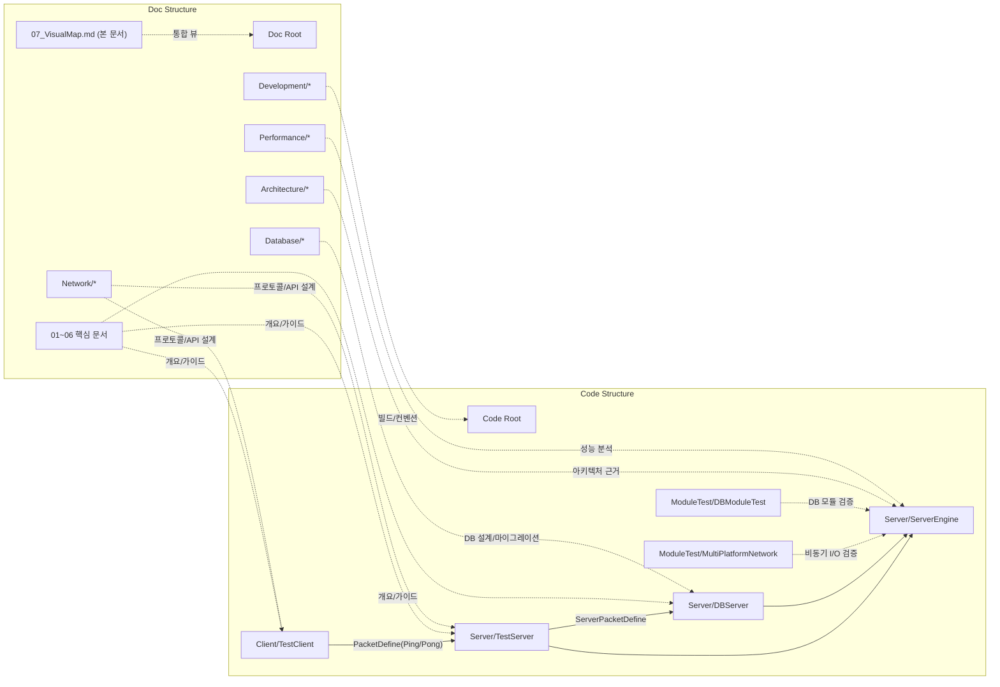
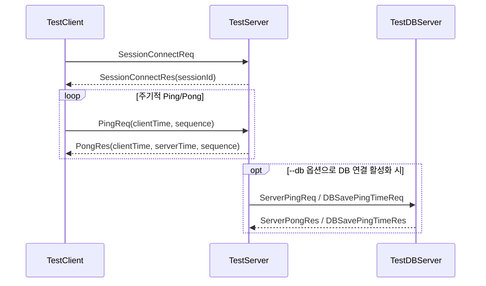
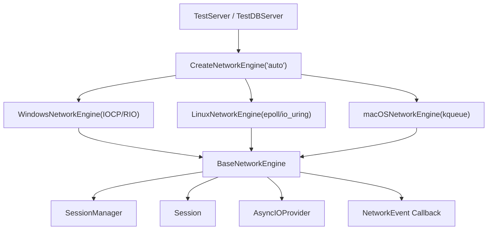
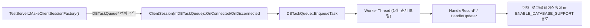
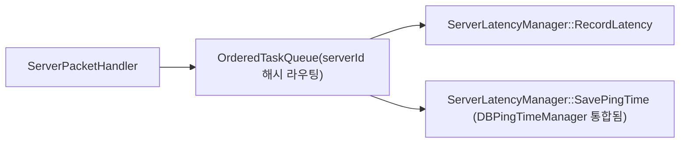

# 📊 코드-문서 통합 시각화 맵

코드 구조와 기존 문서를 함께 볼 수 있도록 만든 통합 시각화 문서입니다.

기준 시점: 2026-02-16
기준 코드: `Server/`, `Client/`, `ModuleTest/`, `Doc/`

---

## 1) 전체 구조 맵 (Code + Docs)



---

## 2) 런타임 패킷 흐름



---

## 3) ServerEngine 계층 시각화



---

## 4) 비동기 DB 처리 경로





> **Note**: `DBPingTimeManager`는 `ServerLatencyManager`에 통합됨 — `SavePingTime` / `GetLastPingTime` 메서드가 `ServerLatencyManager`로 이전.

---

## 5) 디렉터리 구조 (요약)

```text
NetworkModuleTest/
├─ Client/
│  └─ TestClient/
│     ├─ include/
│     ├─ src/
│     └─ main.cpp
├─ Server/
│  ├─ ServerEngine/
│  │  ├─ Network/Core/
│  │  ├─ Network/Platforms/
│  │  ├─ Platforms/Windows|Linux|macOS/
│  │  ├─ Database/
│  │  └─ Utils/
│  ├─ TestServer/
│  │  ├─ include/
│  │  ├─ src/
│  │  └─ main.cpp
│  └─ DBServer/
│     ├─ include/
│     ├─ src/
│     └─ main.cpp
├─ ModuleTest/
│  ├─ MultiPlatformNetwork/
│  └─ DBModuleTest/
└─ Doc/
   ├─ 01_ProjectOverview.md
   ├─ 02_Architecture.md
   ├─ 03_Protocol.md
   ├─ 04_API.md
   ├─ 05_DevelopmentGuide.md
   ├─ 06_SolutionGuide.md
   ├─ 07_VisualMap.md
   └─ (Architecture|Network|Database|Performance|Development)/
```

---

## 6) 문서 ↔ 코드 매핑

| 문서 | 핵심 코드 경로 | 용도 |
|---|---|---|
| `Doc/01_ProjectOverview.md` | `README.md`, `Server/`, `Client/` | 프로젝트 개요/범위 |
| `Doc/02_Architecture.md` | `Server/ServerEngine/Network/Core/`, `Server/TestServer/`, `Server/DBServer/` | 시스템 구성/흐름 |
| `Doc/03_Protocol.md` | `Server/ServerEngine/Network/Core/PacketDefine.h`, `Server/ServerEngine/Network/Core/ServerPacketDefine.h` | 패킷/프로토콜 |
| `Doc/04_API.md` | `Server/ServerEngine/Network/Core/NetworkEngine.h`, `Server/ServerEngine/Network/Core/AsyncIOProvider.h` | API 인터페이스 |
| `Doc/05_DevelopmentGuide.md` | `CMakeLists.txt`, `run_*.ps1 / run_*.bat`, `*.vcxproj` | 빌드/실행/개발 규칙 |
| `Doc/06_SolutionGuide.md` | `NetworkModuleTest.sln`, `Server/*/*.vcxproj`, `Client/*/*.vcxproj` | 솔루션 구성 |
| `Doc/Architecture/*` | `Server/ServerEngine/`, `Server/TestServer/`, `Server/DBServer/` | 설계 상세 |
| `Doc/Database/*` | `Server/ServerEngine/Database/`, `ModuleTest/DBModuleTest/` | DB 모듈/마이그레이션 |
| `Doc/Network/*` | `Server/ServerEngine/Network/`, `Client/TestClient/` | 네트워크 구현 |
| `Doc/Performance/*` | `Server/ServerEngine/Network/Core/Session.cpp`, `Server/TestServer/src/DBTaskQueue.cpp` | 성능/락 경합 최적화 |

---

## 7) 참고 및 주의

- TestDBServer 기본 포트는 코드상 `8001`입니다 (`Server/DBServer/main.cpp`).
- 실행 스크립트(`run_dbServer.ps1`, `run_allServer.ps1` 등)의 기본 DB 포트는 `8002`입니다.
- 즉, 스크립트로 실행 시에는 `8002` 기준으로 동작합니다.
