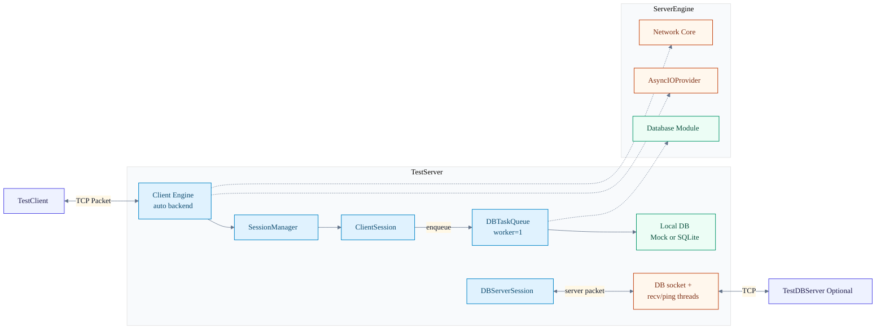
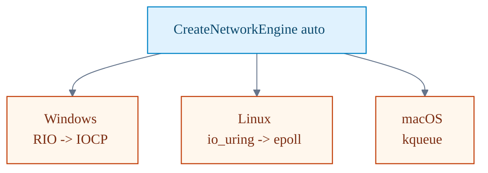

# 01. Overall Architecture

이 페이지는 서버 전체 구성을 한 장으로 보여주고, 어떤 컴포넌트가 어디를 책임지는지 빠르게 정리합니다.

## 정적 이미지 (SVG)

## 전체 구조

## 런타임 백엔드 선택

## 한눈에 보기
1. `TestServer`는 클라이언트용 네트워크 엔진과 DB 연동 경로를 함께 관리합니다.
2. 로컬 DB(Mock/SQLite) 경로와 TestDBServer 연동 경로가 공존합니다.
3. DB 관련 동기 작업은 세션 스레드에서 직접 처리하지 않고 `DBTaskQueue`로 넘깁니다.

## 개발자 체크
1. 새 기능 추가 시 먼저 어느 계층(`Session`, `DBTaskQueue`, `DBServerSession`)에 배치할지 결정합니다.
2. 동기 블로킹 코드가 세션 콜백 경로에 들어가지 않도록 확인합니다.
3. 백엔드 선택 로직은 `CreateNetworkEngine("auto")` 동작을 깨지 않게 유지합니다.

## 운영자 체크
1. 클라이언트 지연이 높으면 DBTaskQueue 적체 여부를 먼저 봅니다.
2. DB 서버 연동 장애와 로컬 DB 경로를 분리해 증상을 확인합니다.
3. Windows 경로와 Linux/macOS 경로의 안정성 기대치를 동일하게 두지 않습니다(검증 범위 차이).

## 참고 코드
- `Server/TestServer/src/TestServer.cpp`
- `Server/TestServer/include/TestServer.h`
- `Doc/02_Architecture.md`

검증일: 2026-02-20
