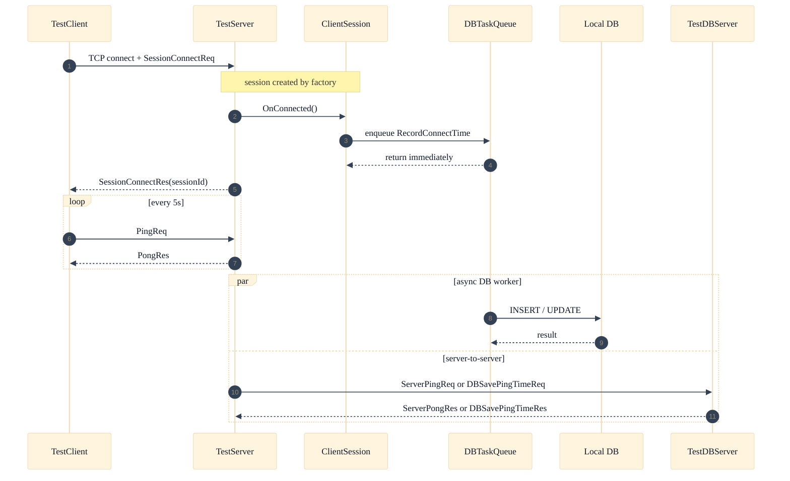

# 03. Packet and AsyncDB Flow

이 페이지는 "클라이언트 패킷 처리"와 "비동기 DB 처리"가 어떻게 분리되는지 보여줍니다.

## 정적 이미지 (SVG)


## 연결/핑/비동기 DB 흐름


## 한눈에 보기
1. `ClientSession`은 DB 응답을 기다리지 않고 즉시 반환합니다.
2. DB 처리는 별도 워커 스레드에서 수행되어 세션 처리와 분리됩니다.
3. TestDBServer 연동은 별도 서버간 패킷 경로로 동작합니다.

## 패킷 헤더 요약
```text
Client <-> TestServer: [uint16 size][uint16 id]
TestServer <-> TestDBServer: [uint16 size][uint16 id][uint32 sequence]
```

## 개발자 체크
1. 클라이언트 패킷 핸들러에서 DB 저장이 필요하면 큐잉 후 즉시 리턴 패턴을 유지합니다.
2. 패킷 헤더 필드(`size`, `id`, `sequence`)는 엔디언/정렬 규칙을 함께 검증합니다.
3. 서버간 패킷은 레거시 MessageHandler 포맷과 혼동하지 않도록 경로를 분리합니다.

## 운영자 체크
1. Ping/Pong 지표와 DB 처리 지표를 분리해서 봐야 병목 위치를 찾기 쉽습니다.
2. DB 지연이 커져도 클라이언트 응답이 즉시 저하되지 않을 수 있으니 큐 길이를 같이 봅니다.

## 참고 코드/문서
- `Doc/03_Protocol.md`
- `Doc/Architecture/AsyncDB.md`
- `Server/TestServer/src/ClientSession.cpp`
- `Server/TestServer/src/DBTaskQueue.cpp`

검증일: 2026-02-20
