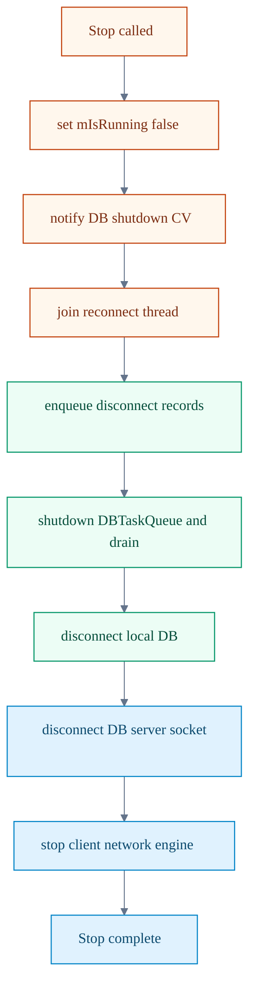

# 04. Graceful Shutdown

이 페이지는 `TestServer::Stop()`의 실제 종료 순서를 시각화합니다.

## 정적 이미지 (SVG)

## 종료 순서 다이어그램

## 한눈에 보기
1. 먼저 종료 플래그와 CV notify로 대기 중인 재연결/핑 루프를 빠르게 깨웁니다.
2. DB 큐 종료 전에 연결 종료 기록을 큐에 넣어 마지막 이벤트 누락을 막습니다.
3. DB 큐를 완전히 비운 뒤 로컬 DB를 끊어 데이터 손실 가능성을 줄입니다.
4. DB 서버 소켓을 정리한 후 네트워크 엔진을 멈춰 소켓 무효화 충돌을 피합니다.

## 개발자 체크
1. 종료 순서를 바꿀 때는 반드시 소켓 무효화 순서와 큐 드레인 순서를 같이 검토합니다.
2. 새 스레드를 추가하면 `Stop()`에서 interrupt + join 경로를 같이 추가합니다.
3. 종료 중 로그 누락이 생기면 우선 `RecordDisconnectTime` 큐잉 시점을 점검합니다.

## 운영자 체크
- 종료 로그에 `DB task queue statistics`가 남는지 확인
- `Queued disconnect records during shutdown`가 필요 시 출력되는지 확인
- DB server 연결을 사용 중이면 `DisconnectFromDBServer` 호출 순서 유지

## 참고 코드
- `Server/TestServer/src/TestServer.cpp`

검증일: 2026-02-20
