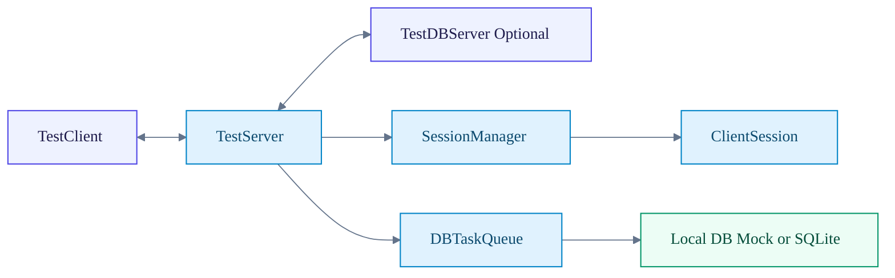

# NetworkModuleTest Server Wiki (Draft)

이 문서는 서버 구조를 처음 보는 사람도 5분 안에 흐름을 잡을 수 있도록 만든 GitHub Wiki 초안입니다.

## 문서 범위
- TestClient, TestServer, TestDBServer 연결 구조
- TestServer 내부 계층과 세션 구조
- 패킷 처리와 비동기 DB 처리 흐름
- 안전 종료(Graceful Shutdown) 순서
- DB 서버 재연결 정책

## 추천 읽기 순서
1. [[01-Overall-Architecture]]
2. [[02-Session-Layer]]
3. [[03-Packet-and-AsyncDB-Flow]]
4. [[04-Graceful-Shutdown]]
5. [[05-Reconnect-Strategy]]

## 5분 요약
- 아키텍처는 2계층: `INetworkEngine` + `AsyncIOProvider`
- 세션 계층: `Session` -> `ClientSession` / `ServerSession` -> `DBServerSession`
- DB 작업은 `DBTaskQueue`로 비동기 처리 (워커 1개 유지)
- 종료 순서 핵심: 세션 종료 기록 큐잉 -> DB 큐 드레인 -> DB 연결 해제 -> 네트워크 엔진 종료

## 페이지 미리보기

## 개발자 빠른 체크
1. 새 세션 타입 추가 시 `Session` 상속 구조를 먼저 맞춥니다.
2. DB 연동 코드는 세션에서 직접 블로킹 호출하지 않고 `DBTaskQueue`로 보냅니다.
3. 종료 로직 변경 시 `Stop()`의 순서를 유지합니다.

## 운영자 빠른 체크
- TestServer: `9000`
- TestDBServer: `8001` (일부 스크립트 기본값은 `8002`)
- 기동 순서: `TestDBServer -> TestServer -> TestClient`
- 장애 시 우선 확인: 재연결 로그, DBTaskQueue 통계 로그

## 상태 메모
- Windows 경로(IOCP/RIO) 중심으로 검증됨
- Linux/macOS 경로는 구현되어 있으나 추가 검증 필요

검증일: 2026-02-20
