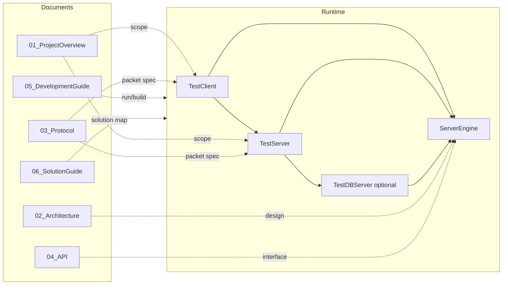
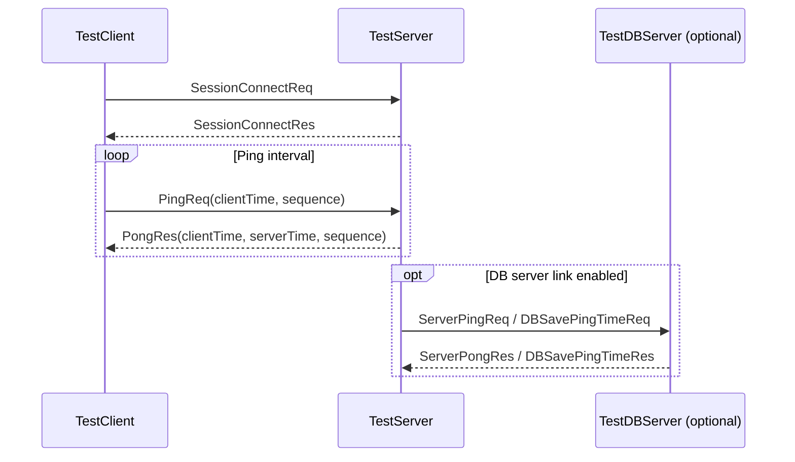

# 코드-문서 시각 맵 (현재 기준)

코드 구조와 핵심 문서가 어디를 설명하는지 빠르게 연결해 보는 인덱스입니다.

## 1. 전체 구조



## 2. 런타임 패킷 경로



## 3. 코드 디렉터리 매핑

```text
Server/ServerEngine/
  Network/Core/          <- 엔진 인터페이스, 세션, 패킷
  Network/Platforms/     <- Windows/Linux/macOS 구현
  Concurrency/           <- KeyedDispatcher, TimerQueue, AsyncScope
  Database/              <- DB 추상화

Server/TestServer/
  src/TestServer.cpp     <- 클라이언트 수용 + 로컬 DBTaskQueue + (옵션) DBServer 링크

Server/DBServer/
  src/TestDBServer.cpp   <- 서버 간 패킷 수신/처리

Client/TestClient/
  src/TestClient.cpp     <- 접속, Ping/Pong, RTT 통계
```

## 4. 문서-코드 매핑 표

| 문서 | 기준 코드 |
|---|---|
| `Doc/01_ProjectOverview.md` | `Server/`, `Client/`, `Doc/` |
| `Doc/02_Architecture.md` | `Server/ServerEngine/`, `Server/TestServer/`, `Server/DBServer/` |
| `Doc/03_Protocol.md` | `Network/Core/PacketDefine.h`, `Network/Core/ServerPacketDefine.h` |
| `Doc/04_API.md` | `Network/Core/NetworkEngine.h`, 각 실행파일 `main.cpp` |
| `Doc/05_DevelopmentGuide.md` | `run_*.ps1`, `*.vcxproj`, 테스트 스크립트 |
| `Doc/06_SolutionGuide.md` | `NetworkModuleTest.sln` 및 솔루션 프로젝트 |

## 5. 주의 사항

- 기본 포트는 플랫폼 define 기반입니다. Windows: Server `19010`, DB `18002`; Linux/macOS: Server `9000`, DB `8001`.
- 검증 페이로드가 포함된 PingPong 포맷은 `ServerEngine/Tests/Protocols`의 테스트 경로이며, 기본 운영 패킷과 분리됩니다.
