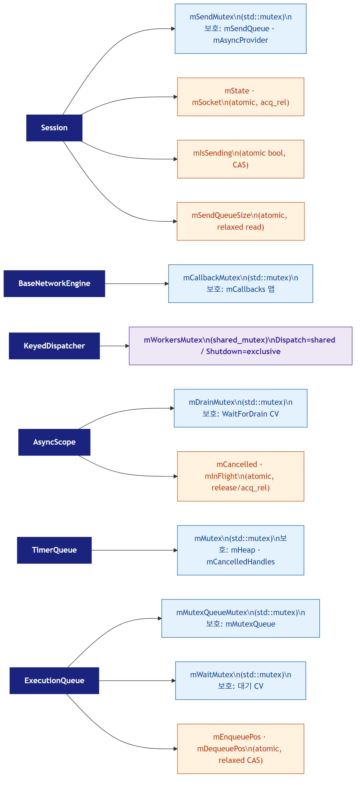
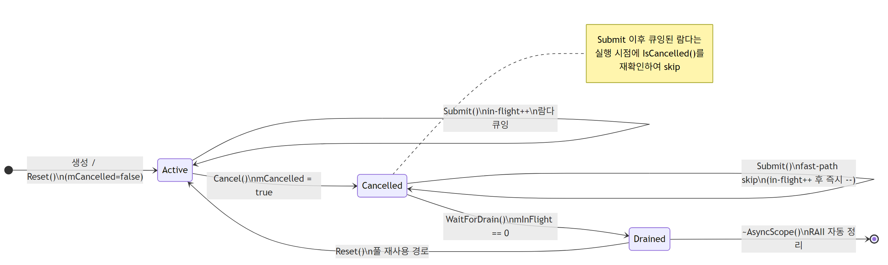
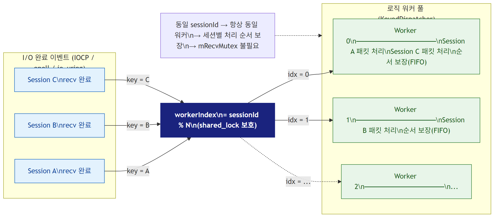
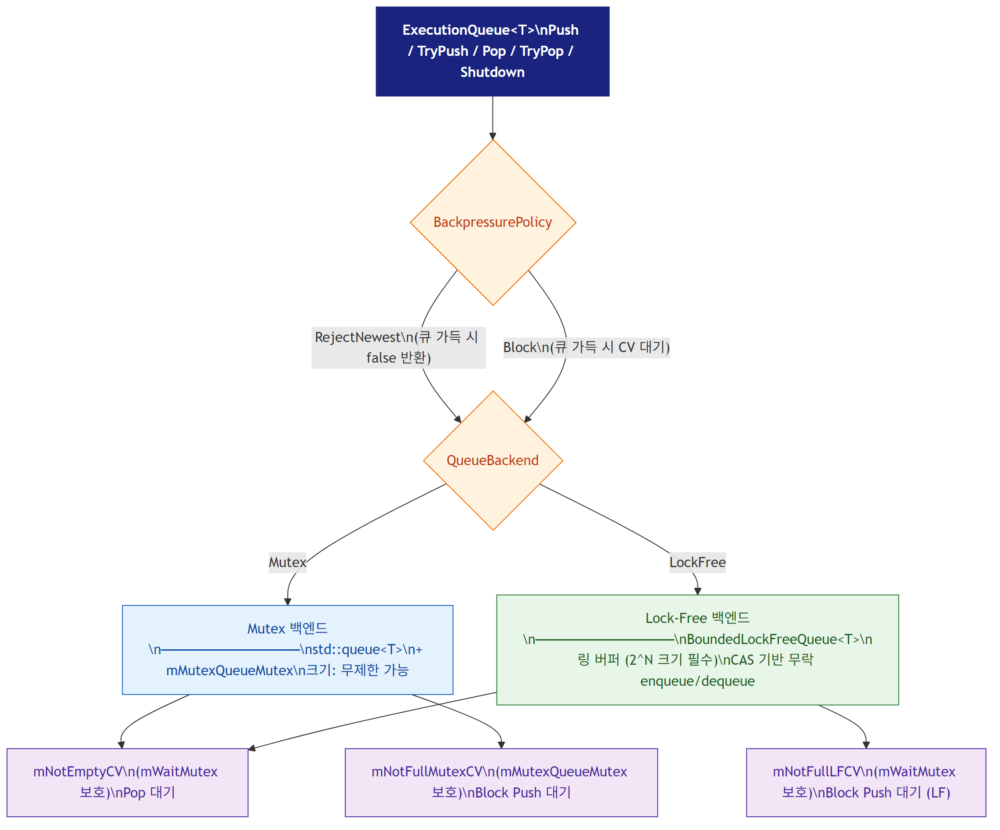

# 동기화·락·비동기 처리 메커니즘 기술 분석

- 최초 작성: 2026-03-10 (Network_Async_DB_Report Sec.11 분리)
- 최종 업데이트: 2026-03-19
- 기준 리포지토리: `NetworkModuleTest`
- 분석 기준: `ServerEngine` 실제 구현 코드
- 목적: ServerEngine이 사용하는 모든 동기화 프리미티브의 역할, 보호 대상, memory ordering 선택 근거를 코드 기준으로 정리

---

## 변경 이력

| 날짜 | 내용 |
|------|------|
| 2026-03-19 | 독립 문서로 분리 — `Network_Async_DB_Report` Sec.11에서 추출 |
| 2026-03-10 | 초기 작성 — 락 구조 총람, memory ordering, AsyncScope 생명주기, KeyedDispatcher, ExecutionQueue |

---

## 1. 락 구조 총람

ServerEngine이 사용하는 동기화 프리미티브는 크게 세 종류다: **mutex**, **shared_mutex**, **atomic**. 각 프리미티브는 단일 책임으로 설계되어 있으며 락 중첩(lock nesting)이 없어 데드락 위험이 없다.

**Mutex 계층 상세**

| 뮤텍스 | 위치 | 보호 대상 | 설계 포인트 |
|--------|------|-----------|------------|
| `mSendMutex` | `Session` | `mSendQueue`, `mAsyncProvider` | 락 내에서 `shared_ptr` 스냅샷만 복사 후 즉시 해제, 실제 I/O 호출은 락 외부에서 수행 |
| `mCallbackMutex` | `BaseNetworkEngine` | `mCallbacks` 이벤트 맵 | 이벤트 등록·해제 시만 짧게 획득 |
| `mDrainMutex` | `AsyncScope` | `WaitForDrain` 조건 대기 | `notify_all`은 mutex 보유 없이 호출해 불필요한 경합 방지 |
| `mMutex` | `TimerQueue` | `mHeap`, `mCancelledHandles` | min-heap 수정 + 취소 집합 관리 |
| `mMutexQueueMutex` | `ExecutionQueue` | `mMutexQueue` (Mutex 백엔드) | |
| `mWaitMutex` | `ExecutionQueue` | `mNotEmptyCV`, `mNotFullLFCV` | |

**shared_mutex**

| 뮤텍스 | 위치 | 설계 포인트 |
|--------|------|------------|
| `mWorkersMutex` | `KeyedDispatcher` | `Dispatch()`: shared lock (다수 I/O 워커 동시 접근), `Shutdown()`: exclusive lock (mWorkers 해제) |

**LockProfiling 지원**

`NET_LOCK_GUARD(mutex)` / `NET_UNIQUE_LOCK(mutex)` 매크로를 사용하면 `NET_LOCK_PROFILING` 빌드 플래그 하나로 모든 락의 **대기 시간(waitNs)**과 **보유 시간(holdNs)**을 프로파일링할 수 있다. 비활성화 시 표준 `std::lock_guard`/`std::unique_lock`으로 zero-overhead 컴파일된다.

코드 포인트: `Server/ServerEngine/Utils/LockProfiling.h:26`

---

## 2. Memory Ordering 패턴

C++ atomic의 memory order는 컴파일러/CPU 재배치를 제어한다. ServerEngine에서 사용하는 패턴을 아래 표로 정리한다.

| 순서 | 의미 | ServerEngine 사용 사례 |
|------|------|----------------------|
| `relaxed` | 재배치 허용, 원자성만 보장 | `mPingSequence` (단순 카운터), `mSendQueueSize` fast-path read (부정확해도 되는 경우) |
| `acquire` | 이 load 이후 메모리 접근이 앞으로 이동 불가 | `mState`, `mSocket`, `mCancelled`, `mInFlight` load — 직전 release write 값을 반드시 봐야 할 때 |
| `release` | 이 store 이전 메모리 쓰기가 뒤로 이동 불가 | `mState`, `mSocket` store, sequence store in BoundedLockFreeQueue — 이후 acquire load에 보임을 보장 |
| `acq_rel` | acquire + release 동시 적용 | `exchange`, `fetch_sub`, `compare_exchange_strong` — 읽기+쓰기가 한 번에 이루어지는 RMW 연산 |

**핵심 패턴: CAS 기반 이중 전송 방지 (`mIsSending`)**

`Session::FlushSendQueue()`는 `compare_exchange_strong(false → true)`로 한 번에 하나의 스레드만 `PostSend()`를 실행하도록 보장한다. 전송 완료 후 `mIsSending.store(false, release)`로 해제하고, TOCTOU 방어를 위해 직후 `mSendQueueSize`를 재확인한다.

코드 포인트: `Server/ServerEngine/Network/Core/Session.cpp:306`

---

## 3. AsyncScope 생명주기

`AsyncScope`는 Session 당 하나씩 존재하며, 로직 스레드풀에 디스패치된 람다가 Session 소멸 후에도 실행되는 문제를 방지한다.

**주요 전이**

| 상태 | 진입 조건 | 동작 |
|------|----------|------|
| **Active** | 생성 (`mCancelled=false`) | `Submit()` 호출 시 in-flight 카운터 증가 후 람다 큐잉 |
| **Cancelled** | `Cancel()` (`mCancelled=true, release`) | 이후 `Submit()` 호출은 fast-path에서 즉시 `EndTask()` (람다 큐잉 불가) |
| **Drained** | `WaitForDrain()` — `mInFlight == 0` 확인 | `AsyncScope` RAII 소멸자가 자동으로 `Cancel() + WaitForDrain()` 호출 |
| **Reset** | `Session::Reset()` 경로 (풀 재사용) | `mCancelled=false`로 복귀. **precondition**: `mInFlight == 0` |

**풀 재사용 버그 방지**

`Session::Reset()` 호출 시 반드시 `mAsyncScope.Reset()`을 함께 호출해야 한다. 누락 시 재사용 세션의 `mCancelled=true`가 잔존하여 모든 recv 람다가 silently skip되고 서버 응답이 불가능해진다.

코드 포인트: `Server/ServerEngine/Concurrency/AsyncScope.h:46`

---

## 4. KeyedDispatcher — 키 친화도 라우팅

`KeyedDispatcher`는 `sessionId`를 key로 사용해 동일 세션의 모든 로직 작업을 항상 같은 워커 스레드로 라우팅한다. 워커 큐의 FIFO 특성과 결합해 세션 단위 순서를 보장한다.

**설계 포인트**

- `Dispatch()`: `shared_lock(mWorkersMutex)` 획득 후 `key % workerCount`로 워커 인덱스 결정 — `Shutdown()`의 `mWorkers.clear()`와 TOCTOU 없이 안전하게 공존
- 결과: `Session::mRecvMutex` 제거 가능 (동일 세션 → 동일 워커 → 순차 실행 보장)
- 결과: `Session::ProcessRawRecv()`에서 락 없는 누적 버퍼 접근 가능

코드 포인트: `Server/ServerEngine/Concurrency/KeyedDispatcher.h:144`

---

## 5. ExecutionQueue — 이중 백엔드 (Mutex / Lock-Free)

`ExecutionQueue<T>`는 `KeyedDispatcher`의 워커 큐로 사용되며 두 가지 백엔드를 지원한다.

**백엔드 비교**

| 항목 | Mutex 백엔드 | Lock-Free 백엔드 |
|------|-------------|-----------------|
| 자료구조 | `std::queue<T>` + `mMutexQueueMutex` | `BoundedLockFreeQueue<T>` (링 버퍼) |
| 크기 제한 | 선택적 (0 = 무제한) | 필수 (기본값 1024, 2의 거듭제곱으로 보정) |
| 백프레셔 정책 | `RejectNewest` 또는 `Block` | `RejectNewest` 또는 `Block` (spin-wait + CV) |
| `mSize` 정확도 | 정확 | ±1 근사 (fetch_add/TryEnqueue 비원자) — 모니터링 전용 |

**BoundedLockFreeQueue 링 버퍼 설계**

각 슬롯(`Cell`)은 `sequence` atomic을 가지며, `enqueuePos` / `dequeuePos`와의 차이로 슬롯 상태를 판별한다.

- `diff == 0`: 슬롯이 비어있음, CAS로 enqueue 위치 선점
- `diff < 0` (enqueue 시): 큐가 가득 참
- `diff < 0` (dequeue 시): 큐가 비어있음

슬롯은 `alignas(64)` 정렬로 false sharing을 방지한다.

코드 포인트: `Server/ServerEngine/Concurrency/BoundedLockFreeQueue.h:60`
