## 1. 요약

이 프로젝트는 `INetworkEngine`(상위 추상화)와 `AsyncIOProvider`(하위 플랫폼 백엔드)로 분리된 2계층 구조를 사용한다.

- 네트워크 처리: 플랫폼별 엔진(Windows/Linux/macOS)이 수락/완료 이벤트를 처리하고, 공통 로직은 `BaseNetworkEngine`이 담당
- 비동기 처리: I/O 워커 스레드 + 로직 스레드풀 + DB 전용 작업큐(`DBTaskQueue`, `OrderedTaskQueue`)로 역할 분리
- DB 처리: `IDatabase` 추상화 위에 `SQLite/Mock/ODBC` 구현을 두고, TestServer는 비동기 큐 기반으로 DB 작업을 오프로딩

핵심 특징:

- Windows: RIO 우선, 실패 시 IOCP 폴백
- Linux: io_uring 우선, 실패 시 epoll 폴백
- macOS: kqueue
- `ClientSession`의 DB 기록은 논블로킹(`DBTaskQueue`)으로 처리
- 종료 시 `DBTaskQueue` 드레인 -> DB 해제 -> 네트워크 종료 순서로 graceful shutdown 수행

## 2. 분석 범위

### 2.1 네트워크 엔진

- `Server/ServerEngine/Network/Core/NetworkEngine.h`
- `Server/ServerEngine/Network/Core/BaseNetworkEngine.h`
- `Server/ServerEngine/Network/Core/BaseNetworkEngine.cpp`
- `Server/ServerEngine/Network/Core/NetworkEngineFactory.cpp`
- `Server/ServerEngine/Network/Core/AsyncIOProvider.h`
- `Server/ServerEngine/Network/Core/AsyncIOProvider.cpp`
- `Server/ServerEngine/Network/Platforms/WindowsNetworkEngine.cpp`
- `Server/ServerEngine/Network/Platforms/LinuxNetworkEngine.cpp`
- `Server/ServerEngine/Network/Platforms/macOSNetworkEngine.cpp`
- `Server/ServerEngine/Network/Core/Session.h`
- `Server/ServerEngine/Network/Core/Session.cpp`
- `Server/ServerEngine/Network/Core/SessionManager.cpp`

### 2.2 TestServer (게임 서버)

- `Server/TestServer/src/TestServer.cpp`
- `Server/TestServer/src/ClientSession.cpp`
- `Server/TestServer/src/ClientPacketHandler.cpp`
- `Server/TestServer/src/DBTaskQueue.cpp`
- `Server/TestServer/src/DBServerPacketHandler.cpp`
- `Server/TestServer/main.cpp`

### 2.3 DBServer

- `Server/DBServer/src/TestDBServer.cpp`
- `Server/DBServer/src/ServerPacketHandler.cpp`
- `Server/DBServer/src/OrderedTaskQueue.cpp`
- `Server/DBServer/src/ServerLatencyManager.cpp`
- `Server/DBServer/main.cpp`
- 참고(대체/실험 경로): `Server/DBServer/src/DBServer.cpp`

## 3.1 계층 구조

`INetworkEngine`가 외부 API를 정의하고(`Initialize/Start/Stop/SendData/CloseConnection`), `BaseNetworkEngine`이 공통 동작을 구현한다.

- 공통: 세션 조회/제거, 이벤트 콜백 등록, 통계 집계
- 플랫폼 특화: 소켓 생성, accept 루프, completion 처리

코드 포인트:

- 인터페이스: `Server/ServerEngine/Network/Core/NetworkEngine.h:72`
- 공통 구현: `Server/ServerEngine/Network/Core/BaseNetworkEngine.cpp:28`

## 3.2 플랫폼 백엔드 선택

엔진 팩토리(`CreateNetworkEngine("auto")`)와 AsyncIO 팩토리가 폴백 체인을 제공한다.

- Windows: RIO -> IOCP
  - `Server/ServerEngine/Network/Core/NetworkEngineFactory.cpp:24`
  - `Server/ServerEngine/Network/Core/AsyncIOProvider.cpp:74`
- Linux: io_uring -> epoll
  - `Server/ServerEngine/Network/Core/NetworkEngineFactory.cpp:58`
  - `Server/ServerEngine/Network/Core/AsyncIOProvider.cpp:104`
- macOS: kqueue
  - `Server/ServerEngine/Network/Core/NetworkEngineFactory.cpp:105`
