## 3.3 연결 수립부터 세션 생성까지

플랫폼 엔진 `AcceptLoop()` 공통 흐름:

1. `accept()`로 소켓 수락
2. `SessionManager::CreateSession()`로 세션 생성
3. `AsyncIOProvider::AssociateSocket()`으로 백엔드 연동
4. 로직 스레드풀에서 `OnConnected` + `Connected 이벤트` 실행
5. 첫 `Recv` 등록

Windows 기준 코드:

- accept 루프: `Server/ServerEngine/Network/Platforms/WindowsNetworkEngine.cpp:128`
- 소켓 associate: `.../WindowsNetworkEngine.cpp:167`
- 연결 이벤트 비동기 실행: `.../WindowsNetworkEngine.cpp:188`

## 3.4 수신 처리와 패킷 재조립

수신 완료 처리(`ProcessCompletions`)에서 `Recv` 완료를 `BaseNetworkEngine::ProcessRecvCompletion()`으로 전달한다.

- 데이터는 로직 스레드풀로 전달된 후 `Session::ProcessRawRecv()` 실행
- `ProcessRawRecv()`는 TCP 스트림을 `PacketHeader(size,id)` 기준으로 재조립
- 유효하지 않은 크기/오버플로우 탐지 시 세션 종료

코드 포인트:

- completion 처리: `Server/ServerEngine/Network/Platforms/WindowsNetworkEngine.cpp:233`
- 공통 recv 완료: `Server/ServerEngine/Network/Core/BaseNetworkEngine.cpp:255`
- TCP 재조립: `Server/ServerEngine/Network/Core/Session.cpp:445`

## 3.5 송신 처리

송신 경로는 플랫폼별로 나뉜다.

- Windows + RIO: `Session::Send()`에서 provider `SendAsync()` 직행
- 그 외(WSASend/epoll/kqueue): `mSendQueue`에 enqueue 후 `PostSend()`로 비동기 송신

`Session`은 `mSendQueueSize`(atomic)와 `mIsSending`(CAS)로 락 경쟁을 줄이고 중복 송신을 방지한다.

코드 포인트:

- 송신 진입: `Server/ServerEngine/Network/Core/Session.cpp:155`
- 큐 플러시/CAS: `.../Session.cpp:248`
- 실제 PostSend: `.../Session.cpp:261`

## 3.6 이벤트 스레드 일관성

`OnDisconnected`는 `CloseConnection()` 경로와 recv 오류 경로 모두 로직 스레드풀로 전달되어 실행된다. 즉, 콜백 호출 스레드가 일관되게 유지된다.

코드 포인트:

- `CloseConnection` 경로: `Server/ServerEngine/Network/Core/BaseNetworkEngine.cpp:155`
- recv 오류 경로: `.../BaseNetworkEngine.cpp:264`
