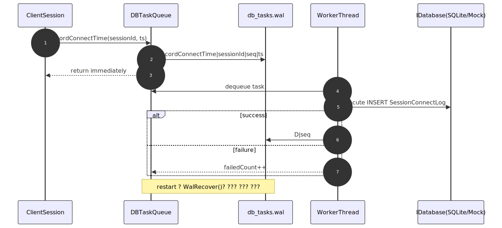

## 4.2 TestServer의 DBTaskQueue (논블로킹 DB)

현재 기본 경로에서 `TestServer`는 연결 이벤트를 직접 받아 `DBTaskQueue`에 작업을 enqueue한다.

- `OnClientConnectionEstablished` -> `RecordConnectTime`
- `OnClientConnectionClosed` -> `RecordDisconnectTime`
- `Stop()` -> active session snapshot -> `RecordDisconnectTime`

코드 포인트:

- 이벤트 핸들러: `Server/TestServer/src/TestServer.cpp:449`, `:472`
- 큐 enqueue / 라우팅: `Server/TestServer/src/DBTaskQueue.cpp:347`, `:385`
- 워커 실행: `.../DBTaskQueue.cpp:536`

중요 설계:

- 현재 런타임 설정은 `Initialize(1, ...)`
- 구현 자체는 워커별 독립 큐 + `sessionId % workerCount` 라우팅으로 같은 세션 순서를 보장

코드 포인트:

- 워커 구조 / 라우팅: `Server/TestServer/include/DBTaskQueue.h:70`, `:154`
- TestServer 현재 설정값: `Server/TestServer/src/TestServer.cpp:131`

## 4.3 WAL 기반 복구

`DBTaskQueue`는 WAL(`db_tasks.wal`)로 크래시 복구를 지원한다.

- enqueue 전 `P|...`(pending) 기록
- 성공 처리 후 `D|seq` 기록
- 재시작 시 WAL(+백업 `.bak`)을 병합 파싱해 미완료 작업만 재큐잉

코드 포인트:

- pending/done 기록: `Server/TestServer/src/DBTaskQueue.cpp:929`, `:989`
- 복구 로직: `.../DBTaskQueue.cpp:1025`

## 4.4 OrderedTaskQueue (DBServer)

`TestDBServer`는 serverId 단위 순서 보장을 위해 `OrderedTaskQueue`를 사용한다.

- 내부적으로 `KeyedDispatcher` 사용
- 같은 key(serverId)는 같은 worker queue로 라우팅
- worker FIFO로 key 단위 순서 보장

코드 포인트:

- facade: `Server/DBServer/src/OrderedTaskQueue.cpp:29`
- keyed dispatch: `.../OrderedTaskQueue.cpp:109`
- dispatcher 구현: `Server/ServerEngine/Concurrency/KeyedDispatcher.h:30`

## 5.1 공통 DB 추상화 계층

DB 레이어는 `IDatabase` / `IStatement` 인터페이스 기반으로 구현체를 교체 가능하게 설계되어 있다.

- 구현체: `MockDatabase`, `SQLiteDatabase`, `ODBCDatabase`, `OLEDBDatabase`
- 생성: `DatabaseFactory::CreateDatabase()`

코드 포인트:

- 인터페이스: `Server/ServerEngine/Interfaces/IDatabase.h:29`
- 팩토리: `Server/ServerEngine/Database/DatabaseFactory.cpp:19`
