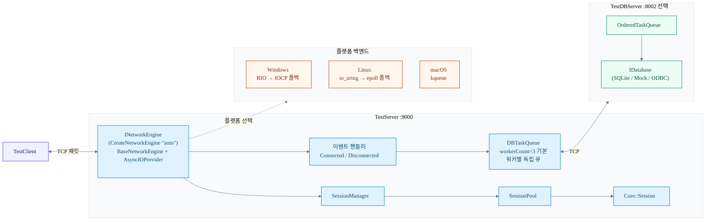

# 01. 전체 구조

## 개요

NetworkModuleTest는 `INetworkEngine`(상위 추상화)과 `AsyncIOProvider`(플랫폼 백엔드)로 분리된 2계층 네트워크 엔진 위에서 동작한다.
TestServer(포트 9000)가 클라이언트 연결을 처리하고, 접속·종료 이벤트를 비동기 `DBTaskQueue`를 통해 TestDBServer(포트 8002, 선택)로 오프로딩한다.
플랫폼별로 Windows는 RIO→IOCP 폴백, Linux는 io_uring→epoll 폴백, macOS는 kqueue를 사용한다.

## 다이어그램




## 상세 설명

### 2계층 엔진 구조

| 계층 | 클래스 | 역할 |
|------|--------|------|
| 상위 추상화 | `INetworkEngine` | 생명주기(`Initialize/Start/Stop`), 데이터 송수신, 이벤트 콜백 등록 API 정의 |
| 공통 구현 | `BaseNetworkEngine` | 세션 관리, 이벤트 디스패치, 통계 집계 — 템플릿 메서드 패턴 |
| 플랫폼 백엔드 | `AsyncIOProvider` | 소켓 생성, accept 루프, I/O 완료 처리 — 플랫폼별 파생 클래스 |

엔진 인스턴스는 `CreateNetworkEngine("auto")`로 생성한다. `"auto"` 타입은 현재 플랫폼과 커널 지원 여부를 런타임에 확인해 최적 백엔드를 선택한다.

### 플랫폼 선택 규칙

- **Windows**: RIO(Registered I/O) 초기화 시도 → 실패 시 IOCP로 폴백
- **Linux**: io_uring 초기화 시도 → 실패 시 epoll로 폴백
- **macOS**: kqueue (단일 경로, 폴백 없음)

폴백 체인은 `NetworkEngineFactory.cpp`와 `AsyncIOProvider.cpp`에 구현되어 있다.

### 컴포넌트 구성

**TestServer (포트 9000)**

- `SessionManager` + `SessionPool`: 연결된 클라이언트 세션 풀 관리
- `Core::Session`: 개별 TCP 연결 단위. recv 콜백은 `SetSessionConfigurator()`가 `SetOnRecv()`로 등록
- 이벤트 핸들러: `Connected` / `Disconnected` 이벤트 수신 시 `DBTaskQueue`에 작업 enqueue

**TestDBServer (포트 8002, 선택)**

- 독립 프로세스로 실행되며, TestServer가 없어도 단독 기동 가능
- `OrderedTaskQueue`: 클라이언트별 순서 보장 작업 처리
- `IDatabase` 추상화: SQLite · Mock · ODBC 구현 교체 가능

**실행 순서**: TestDBServer(8002) → TestServer(9000) → TestClient

### DB 비동기 흐름

```
이벤트 핸들러 (Connected / Disconnected)
    │
    ▼
DBTaskQueue.Enqueue(task)       ← 호출 스레드 즉시 반환
    │
    ▼  (워커별 독립 큐, 기본 workerCount=3)
IDatabase::Execute(...)         ← DB 워커 스레드에서 실행
    │
    ▼
TestDBServer TCP 소켓 (포트 8002)
```

종료 시에는 `DBTaskQueue` 드레인 → DB 해제 → 네트워크 종료 순서로 graceful shutdown을 수행한다.

## 관련 코드 포인트

| 항목 | 파일 및 위치 |
|------|-------------|
| `INetworkEngine` 인터페이스 정의 | `Server/ServerEngine/Network/Core/NetworkEngine.h:52` |
| `BaseNetworkEngine` 공통 구현 | `Server/ServerEngine/Network/Core/BaseNetworkEngine.h:30` |
| 엔진 팩토리 (플랫폼 분기) | `Server/ServerEngine/Network/Core/NetworkEngineFactory.cpp` |
| AsyncIOProvider 폴백 체인 | `Server/ServerEngine/Network/Core/AsyncIOProvider.cpp` |
| TestServer 이벤트 핸들러 | `Server/TestServer/src/TestServer.cpp` |
| DBTaskQueue 구현 | `Server/TestServer/src/DBTaskQueue.cpp` |
| OrderedTaskQueue 구현 | `Server/DBServer/src/OrderedTaskQueue.cpp` |
| SessionManager | `Server/ServerEngine/Network/Core/SessionManager.cpp` |
