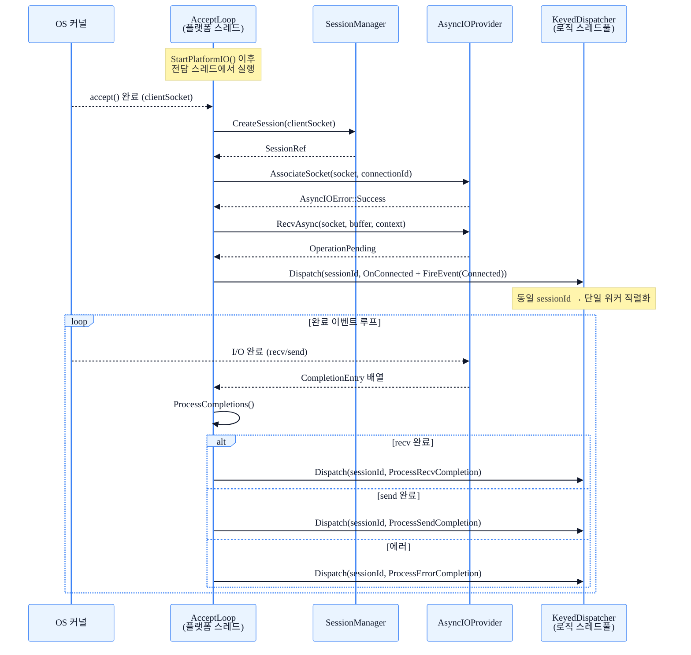
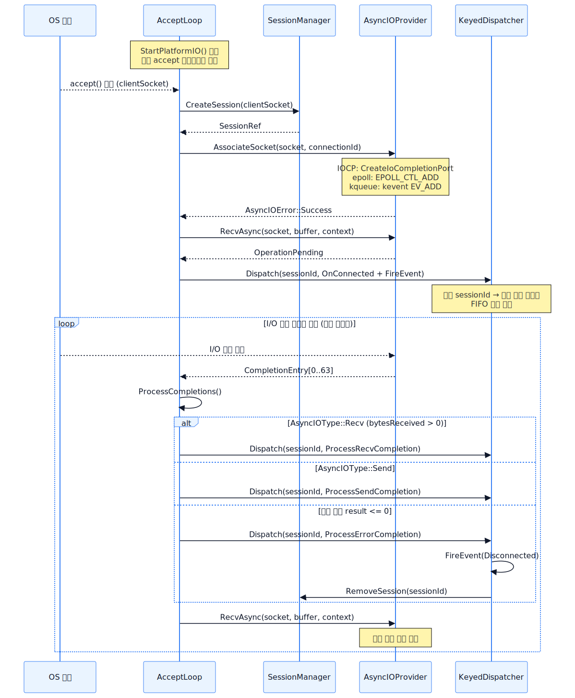

# 02. 네트워크 엔진

## 개요

네트워크 엔진은 **3계층**으로 구성된다.

| 계층 | 클래스/인터페이스 | 역할 |
|------|------------------|------|
| 공개 API | `INetworkEngine` | `Initialize / Start / Stop / SendData` 등 외부 계약 정의 |
| 공통 구현 | `BaseNetworkEngine` | 세션 관리, `ProcessRecvCompletion`, `KeyedDispatcher` 로직 스레드풀 dispatch |
| 플랫폼 백엔드 | `AsyncIOProvider` | accept / recv / send 비동기 작업의 플랫폼별 구현 진입점 |

`BaseNetworkEngine`은 **템플릿 메서드 패턴**을 사용하여 공통 흐름을 고정하고, `AcceptLoop()` · `ProcessCompletions()` · `InitializePlatform()` 등 6개의 순수 가상 훅만 파생 클래스에 위임한다.

플랫폼별 구현은 3개다.

- `WindowsNetworkEngine` — RIO(Registered I/O, Windows 8+) → IOCP 폴백
- `LinuxNetworkEngine` — io_uring(커널 5.1+) → epoll 폴백
- `macOSNetworkEngine` — kqueue (단일 경로)

`AsyncIOProvider`는 순수 추상 인터페이스로, 런타임에 `CreateAsyncIOProvider()` 팩토리가 OS와 커널 버전을 감지해 최적 백엔드를 반환한다.

---

## 다이어그램





---

## 상세 설명

### AsyncIOProvider — 플랫폼 I/O 추상화

`AsyncIOProvider`(`Network/Core/AsyncIOProvider.h`)는 비동기 I/O의 최하위 추상 계층이다.
주요 가상 메서드:

| 메서드 | 설명 |
|--------|------|
| `Initialize(queueDepth, maxConcurrent)` | 큐/링 초기화 |
| `AssociateSocket(socket, context)` | accept 후 소켓을 I/O 백엔드에 등록 |
| `SendAsync / RecvAsync` | 비동기 송수신 요청 발행 |
| `FlushRequests()` | RIO·io_uring의 배치 커밋 (IOCP는 no-op) |
| `ProcessCompletions(entries, max, timeoutMs)` | 완료된 항목 수집 (IOCP GetQueuedCompletionStatus · io_uring CQ 폴링 · epoll_wait 등) |
| `RegisterBuffer / UnregisterBuffer` | RIO·io_uring 전용 버퍼 사전 등록 |

`RequestContext`(`uint64_t`)에 `ConnectionId`를 담아 완료 이벤트를 세션과 매핑한다.

#### 폴백 체인

```
Windows 8+  : RIO  → IOCP  → nullptr
Windows 7-  : IOCP → nullptr
Linux 5.1+  : io_uring → epoll → nullptr
Linux 4.x   : epoll → nullptr
macOS       : kqueue → nullptr
```

### BaseNetworkEngine — 공통 로직

`BaseNetworkEngine`(`Network/Core/BaseNetworkEngine.h`)이 담당하는 기능:

- **세션 생명주기**: `SessionPool` 선점 할당 → `SessionManager` 등록/해제
- **수신 완료 처리**: `ProcessRecvCompletion(session, bytesReceived, data)` — `bytesReceived ≤ 0`이면 연결 종료로 처리
- **송신 완료 처리**: `ProcessSendCompletion`, 에러 시 `ProcessErrorCompletion`으로 라우팅
- **이벤트 발행**: `FireEvent(eventType, connId, ...)` — 등록된 콜백 + `NetworkEventBus` 동시 발행
- **로직 디스패치**: `KeyedDispatcher`(기본 워커 4개) — `sessionId`를 키로 삼아 동일 세션 이벤트를 단일 워커에 직렬화(FIFO 보장)
- **타이머**: `TimerQueue` — 세션 타임아웃 주기 점검 등 엔진 수준 주기 작업
- **통계**: `atomic` 카운터(`mTotalBytesSent`, `mTotalBytesReceived`, `mTotalSendErrors`, `mTotalRecvErrors`)

### accept 흐름 단계별

```
1. AcceptLoop()
   └─ accept() / AcceptEx() 블로킹 대기

2. SessionManager::CreateSession(clientSocket)
   └─ SessionPool에서 슬롯 선점, Session 객체 초기화

3. AsyncIOProvider::AssociateSocket(socket, connectionId)
   └─ Windows: CreateIoCompletionPort(socket, iocp, connId, 0)
   └─ Linux  : epoll_ctl(EPOLL_CTL_ADD) 또는 io_uring 등록
   └─ macOS  : kevent(EV_ADD)

4. AsyncIOProvider::RecvAsync(socket, buffer, context)
   └─ 첫 번째 비동기 수신 작업 투입

5. KeyedDispatcher::Dispatch(sessionId, λ)
   λ → session->OnConnected()
   λ → FireEvent(NetworkEvent::Connected, connId)
   (로직 스레드풀에서 실행, 세션 단위 직렬화 보장)
```

### I/O 완료 처리 흐름

`ProcessCompletions()` 루프(플랫폼 워커 스레드)는 `AsyncIOProvider::ProcessCompletions()`로 완료 항목을 최대 64개씩 수집한다.
각 `CompletionEntry`의 `mContext`(= `ConnectionId`)로 세션을 조회한 뒤 `mType`에 따라:

- `AsyncIOType::Recv` → `BaseNetworkEngine::ProcessRecvCompletion()`
- `AsyncIOType::Send` → `BaseNetworkEngine::ProcessSendCompletion()`
- 결과 ≤ 0 또는 `mOsError ≠ 0` → `BaseNetworkEngine::ProcessErrorCompletion()`

모든 콜백 실행은 `KeyedDispatcher`를 통해 로직 스레드풀로 오프로딩된다.

---

## 관련 코드 포인트

| 항목 | 파일 및 위치 |
|------|-------------|
| `AsyncIOProvider` 인터페이스 | `Server/ServerEngine/Network/Core/AsyncIOProvider.h:184` |
| `AsyncIOProvider` 팩토리 함수 | `Server/ServerEngine/Network/Core/AsyncIOProvider.h:300` |
| `BaseNetworkEngine` 선언 | `Server/ServerEngine/Network/Core/BaseNetworkEngine.h:30` |
| `ProcessRecvCompletion` | `Server/ServerEngine/Network/Core/BaseNetworkEngine.h:90` |
| `ProcessErrorCompletion` | `Server/ServerEngine/Network/Core/BaseNetworkEngine.h:108` |
| `BaseNetworkEngine::Initialize` | `Server/ServerEngine/Network/Core/BaseNetworkEngine.cpp:32` |
| Windows `AcceptLoop()` 구현 | `Server/ServerEngine/Network/Platforms/WindowsNetworkEngine.cpp:142` |
| Windows `AssociateSocket` 호출 | `Server/ServerEngine/Network/Platforms/WindowsNetworkEngine.cpp:180` |
| Windows `OnConnected` dispatch | `Server/ServerEngine/Network/Platforms/WindowsNetworkEngine.cpp:204` |
| Windows `ProcessCompletions()` 구현 | `Server/ServerEngine/Network/Platforms/WindowsNetworkEngine.cpp:257` |
| Linux `AcceptLoop()` 구현 | `Server/ServerEngine/Network/Platforms/LinuxNetworkEngine.cpp:163` |
| Linux `ProcessCompletions()` 구현 | `Server/ServerEngine/Network/Platforms/LinuxNetworkEngine.cpp:291` |
| `KeyedDispatcher` 선언 | `Server/ServerEngine/Concurrency/KeyedDispatcher.h` |
