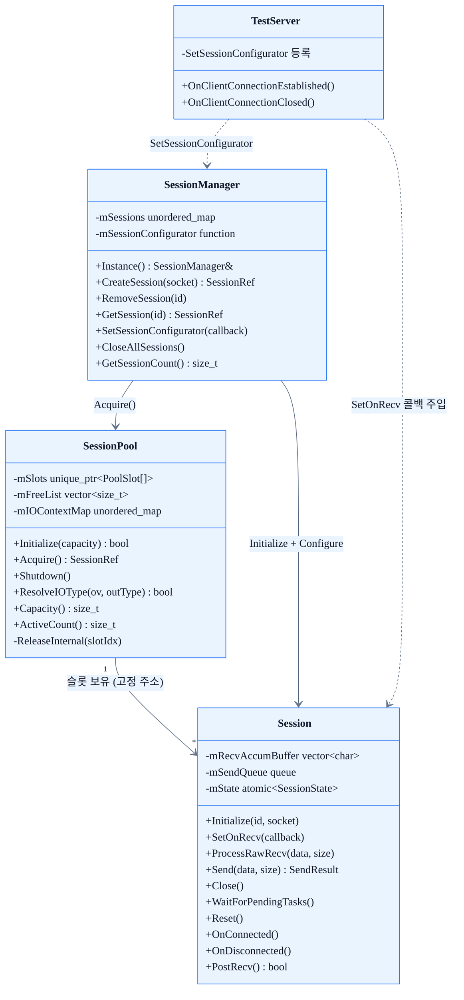

# 03. 세션 계층

## 개요

세션 계층은 개별 TCP 연결의 생명주기를 관리하는 3개의 핵심 클래스로 구성된다.

| 클래스 | 역할 |
|--------|------|
| `Session` | 단일 TCP 연결 단위. 소켓 핸들, 상태, 수신 재조립, 송신 큐 관리 |
| `SessionPool` | 사전 할당된 Session 배열. Accept마다 발생하는 힙 할당을 제거하고 슬롯 재사용 |
| `SessionManager` | 세션 생성·조회·제거 싱글턴. `SetSessionConfigurator()`로 첫 recv 이전에 콜백 등록 보장 |

세션은 `SessionPool`에서 획득되고 `SessionManager`에 등록된 뒤 클라이언트와 데이터를 주고받는다.
연결 종료 시에는 `Close()` → `WaitForPendingTasks()` → `Reset()` → 풀 반납 순서로 정리된다.

## 다이어그램




## 상세 설명

### Session

`Session`은 단일 TCP 연결을 나타내며 `enable_shared_from_this`를 상속한다.

#### 생명주기

| 단계 | 메서드 | 설명 |
|------|--------|------|
| 초기화 | `Initialize(id, socket)` | ConnectionId·소켓 할당, 상태를 `Connected`로 전환 |
| 연결 알림 | `OnConnected()` | 파생 클래스 오버라이드 포인트 (기본 구현은 no-op) |
| 수신 등록 | `PostRecv()` | IOCP에 WSARecv 등록 (POSIX에서는 `AsyncIOProvider::RecvAsync()`가 직접 구동하므로 미사용) |
| 종료 요청 | `Close()` | 소켓 교체(exchange)로 원자적 종료, `AsyncScope::Cancel()` 호출 |
| 태스크 드레인 | `WaitForPendingTasks()` | in-flight AsyncScope 태스크가 완료될 때까지 블로킹 |
| 상태 초기화 | `Reset()` | 재사용을 위한 ID·상태·카운터·누적 버퍼 초기화 |
| 종료 알림 | `OnDisconnected()` | 파생 클래스 오버라이드 포인트 |

풀 세션은 소멸자가 호출되지 않으므로 `WaitForPendingTasks()`가 `~AsyncScope()`의 RAII 드레인을 대신한다.

#### SetOnRecv 콜백

```
using OnRecvCallback = std::function<void(Session*, const char*, uint32_t)>;
void SetOnRecv(OnRecvCallback cb);
```

`SessionManager::CreateSession()` 내부에서 `Initialize()` 이후, `PostRecv()` 이전에 `SetSessionConfigurator` 콜백을 통해 1회 설정된다.
이 순서 덕분에 첫 recv 완료 이벤트가 발생하기 전에 콜백이 반드시 등록된다.
`Reset()` 시 초기화되어 슬롯 재사용 시 이전 콜백 누수가 없다.

#### ProcessRawRecv — TCP 스트림 재조립

TCP는 메시지 경계를 보장하지 않으므로 `ProcessRawRecv`가 원시 바이트 스트림에서 패킷 경계를 복원한다.

```
PacketHeader { uint16_t size; uint16_t id; }  // 4바이트, pack(1)
```

재조립 흐름:

```
원시 바이트 수신 (IOCP / epoll 완료)
    │
    ▼
mRecvAccumBuffer 에 append
    │
    ▼
루프: 누적 바이트 >= sizeof(PacketHeader)?
    ├── NO  → 다음 수신 대기
    └── YES
        ├── header.size < PACKET_HEADER_SIZE  → 세션 종료 (유효하지 않은 크기)
        ├── header.size > MAX_PACKET_SIZE     → 세션 종료 (오버플로우 방지)
        ├── 누적 바이트 < header.size         → 다음 수신 대기 (단편화)
        └── 완성 패킷 → OnRecv(data, size) 호출
                        │
                        ▼
                    mOnRecvCb(session, data, size)
```

`mRecvAccumOffset`이 절반을 초과하면 버퍼를 앞으로 compact하여 메모리 낭비를 방지한다.
`mRecvBatchBuf`는 `Initialize()`에서 예약되어 호출 간 할당 비용을 상각한다.

#### 송신 — SendResult

`Send(data, size)`는 백프레셔 피드백을 위해 `SendResult`를 반환한다.

| 반환값 | 의미 |
|--------|------|
| `Ok` | 패킷 큐잉 또는 전송 성공 |
| `QueueFull` | 미전송 큐가 `MAX_SEND_QUEUE_DEPTH(1000)` 초과 |
| `NotConnected` | 세션이 Connected 상태가 아님 |
| `InvalidArgument` | 크기가 0이거나 `MAX_PACKET_SIZE(4096)` 초과 |

`mIsSending` atomic을 CAS로 사용해 이중 PostSend를 방지한다.

#### 플랫폼별 IO 컨텍스트

| 플랫폼 | 수신 버퍼 | 설명 |
|--------|-----------|------|
| Windows | `IOContext mRecvContext` (OVERLAPPED 내장) | WSARecv에 직접 전달 |
| POSIX | `std::array<char, RECV_BUFFER_SIZE> mRecvBuffer` | `RecvAsync()`에 전달 |

`RECV_BUFFER_SIZE = 8192` (MAX_PACKET_SIZE 4096의 2배).
단일 recv 호출에서 최대 2개 패킷이 겹쳐 도달하는 경우를 수용한다.

---

### SessionPool

```
bool Initialize(size_t capacity);
SessionRef Acquire();          // 풀 고갈 시 nullptr 반환
// Release는 shared_ptr deleter가 자동 호출
```

`Initialize(capacity)` 호출 시 `PoolSlot[]`을 고정 주소에 사전 할당한다.
`Acquire()`가 반환하는 `shared_ptr`의 커스텀 deleter가 마지막 참조 소멸 시 `ReleaseInternal(slotIdx)`를 자동 호출하여 슬롯을 반납한다.

#### 설계 포인트

- `alignas(64) PoolSlot`: 핫 atomic 필드를 별도 캐시 라인에 배치하여 false sharing 방지
- `mFreeList` (O(1) 프리리스트 스택): `back()/pop_back()`으로 대여, `push_back()`으로 반납
- 고정 주소 보장: 슬롯 이동이 없으므로 `IOContext` 내 `OVERLAPPED` 포인터가 안정적 (Windows)
- `mIOContextMap`: `Initialize()` 이후 불변. 다중 스레드 읽기에 락 불필요
- `ResolveIOType(OVERLAPPED*, IOType&)`: OVERLAPPED 포인터로 Recv/Send 방향을 lock-free 판별

#### 활성 세션 카운터

`mActiveCount` (atomic)로 현재 대여 중인 슬롯 수를 추적한다.
`Shutdown()` 시 잔여 슬롯이 있으면 감지할 수 있다.

---

### SessionManager

`SessionManager::Instance()`로 접근하는 싱글턴. `mMutex`로 `mSessions` 맵을 보호한다.

#### CreateSession 흐름

```
BaseNetworkEngine (accept 완료)
    │
    ▼
SessionManager::CreateSession(socket)
    ├── SessionPool::Acquire()          ← 슬롯 획득
    ├── session->Initialize(id, socket) ← ConnectionId·소켓 설정
    ├── mSessionConfigurator(session)   ← SetOnRecv 등 콜백 주입
    ├── mSessions[id] = session         ← 활성 맵에 등록 (mMutex 보호)
    └── session->PostRecv()             ← IOCP 수신 등록 (플랫폼별)
```

`SetSessionConfigurator(callback)` 덕분에 `PostRecv()` 이전에 콜백이 반드시 등록된다.
이 순서가 깨지면 첫 recv 완료 시 `mOnRecvCb`가 null인 채로 `OnRecv`가 실행될 수 있다.

#### SetSessionConfigurator — TestServer 연동

```cpp
// TestServer 초기화 시
SessionManager::Instance().SetSessionConfigurator([this](Session* session) {
    session->SetOnRecv([this](Session* s, const char* data, uint32_t size) {
        // 패킷 처리 로직
    });
});
```

이 패턴은 제거된 `SessionFactory` 패턴을 대체하며, 세션 타입 계층 없이도 동적으로 동작을 주입할 수 있다.

#### 세션 조회 및 순회

| 메서드 | 설명 |
|--------|------|
| `GetSession(id)` | ConnectionId로 단일 세션 반환 |
| `ForEachSession(func)` | 활성 세션 순회 (mMutex 보호) |
| `GetAllSessions()` | 경합 없는 순회를 위한 스냅샷 반환 |
| `GetSessionCount()` | 활성 세션 수 반환 |
| `CloseAllSessions()` | 전체 세션 Close |

---

### PacketHeader 구조

```cpp
#pragma pack(push, 1)
struct PacketHeader {
    uint16_t size;  // 패킷 전체 크기 (헤더 포함)
    uint16_t id;    // PacketType 열거형 값
};
// sizeof(PacketHeader) == 4 (static_assert 보장)
#pragma pack(pop)
```

| 상수 | 값 | 설명 |
|------|----|------|
| `PACKET_HEADER_SIZE` | 4 B | `sizeof(PacketHeader)` |
| `MAX_PACKET_SIZE` | 4096 B | 와이어 크기 상한 (헤더 포함) |
| `MAX_PACKET_PAYLOAD_SIZE` | 4092 B | `MAX_PACKET_SIZE - PACKET_HEADER_SIZE` |
| `RECV_BUFFER_SIZE` | 8192 B | 단일 recv 버퍼 크기 |
| `MAX_SEND_QUEUE_DEPTH` | 1000 | 세션당 미전송 한도 초과 시 `QueueFull` |

`ProcessRawRecv`에서 `header.size < PACKET_HEADER_SIZE` 또는 `header.size > MAX_PACKET_SIZE`를 탐지하면 즉시 세션을 종료해 버퍼 오버플로우를 방지한다.

## 관련 코드 포인트

| 항목 | 파일 |
|------|------|
| `Session` 선언 | `Server/ServerEngine/Network/Core/Session.h` |
| `Session` 구현 | `Server/ServerEngine/Network/Core/Session.cpp` |
| `SessionPool` 선언 | `Server/ServerEngine/Network/Core/SessionPool.h` |
| `SessionPool` 구현 | `Server/ServerEngine/Network/Core/SessionPool.cpp` |
| `SessionManager` 선언 | `Server/ServerEngine/Network/Core/SessionManager.h` |
| `SessionManager` 구현 | `Server/ServerEngine/Network/Core/SessionManager.cpp` |
| `PacketHeader` 정의 | `Server/ServerEngine/Network/Core/PacketDefine.h` |
| `IOContext` (Windows) | `Server/ServerEngine/Network/Core/Session.h:50` |
| TestServer configurator 등록 | `Server/TestServer/src/TestServer.cpp` |
