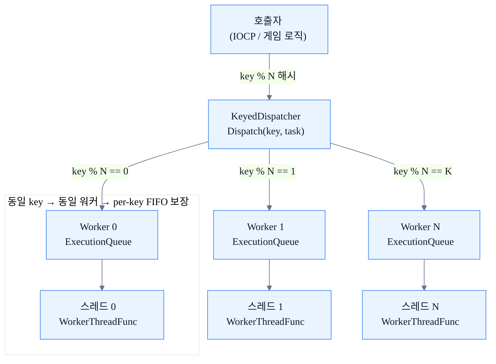

# 04. 동시성 런타임

## 개요

`Network::Concurrency` 네임스페이스는 서버 엔진의 비동기 실행 기반을 이루는 다섯 가지 컴포넌트로 구성된다. 각 컴포넌트는 단일 책임을 갖고, 상위 레이어(`DBTaskQueue`, `OrderedTaskQueue`)가 이를 조합하여 세션 단위 순서 보장과 백프레셔 제어를 동시에 달성한다.

| 컴포넌트 | 역할 |
|---|---|
| `ExecutionQueue<T>` | 백프레셔 정책 + 용량 제한이 있는 mutex 기반 FIFO 큐 |
| `KeyedDispatcher` | 키 친화도(key % workerCount) 라우팅으로 per-key 순서 보장 |
| `AsyncScope` | 인플라이트 작업 수 추적 + 협력 취소(Cancel/WaitForDrain) |
| `Channel<T>` | `ExecutionQueue`의 Send/Receive 의미론 래퍼 |
| `TimerQueue` | min-heap 기반 단발/반복 타이머 |

---

## 다이어그램





---

## 상세 설명

### ExecutionQueue\<T\>

**헤더:** `Concurrency/ExecutionQueue.h`

백프레셔 제어를 지원하는 mutex 기반 FIFO 큐. `ExecutionQueueOptions<T>`로 동작 정책을 주입받는다.

#### BackpressurePolicy

| 정책 | 동작 | 적합한 상황 |
|---|---|---|
| `RejectNewest` (기본) | 큐가 가득 찼을 때 새 작업을 즉시 거부, `false` 반환 | IOCP 완료 포트처럼 생산자가 논블로킹이어야 하는 I/O 스레드 |
| `Block` | 큐에 빈 자리가 생길 때까지 생산자를 블로킹 (선택적 타임아웃) | 유실 없이 흐름 제어가 필요한 배치 처리 |

`RejectNewest`는 작업 유실 가능성이 있으므로 상위 레이어에서 재시도 또는 에러 처리가 필요하다.

#### 용량 제한 (mCapacity)

`mCapacity == 0`이면 무제한, `mCapacity > 0`이면 항목 수가 해당 값에 도달했을 때 정책에 따라 거부 또는 대기가 발생한다.

#### API 요약

| 메서드 | 설명 |
|---|---|
| `TryPush(T)` | 항상 논블로킹. 정책과 무관하게 공간이 없으면 즉시 `false` |
| `Push(T, timeoutMs)` | `Block` 정책일 때 타임아웃까지 대기, `RejectNewest`면 `TryPush`와 동일 |
| `TryPop(T&)` | 항상 논블로킹 |
| `Pop(T&, timeoutMs)` | 항목이 없으면 타임아웃까지 대기 |
| `Shutdown()` | 모든 대기자를 깨우고 이후 Push/Pop을 즉시 거부 |

`mShutdown`은 `std::atomic<bool>`로 관리되며 `acq_rel` 쌍으로 가시성이 보장된다. `Shutdown()` 이후에도 큐에 이미 들어온 잔여 항목은 `PopWait` 내부 drain 경로에서 소비될 수 있다.

---

### KeyedDispatcher

**헤더:** `Concurrency/KeyedDispatcher.h`

키 친화도(key affinity) 기반 순서 보장 비동기 디스패처. 내부적으로 `ExecutionQueue<std::function<void()>>` 배열과 워커 스레드 배열을 1:1로 유지한다.

#### 라우팅 규칙

```
workerIndex = key % workerCount
```

동일한 `key`는 항상 동일한 `workerIndex`로 수렴한다. 각 워커는 단일 스레드가 처리하므로 같은 `key`의 작업은 **제출 순서대로(per-key FIFO)** 실행이 보장된다.

세션 ID를 `key`로 사용하면 동일 세션의 DB 작업이 항상 같은 워커에 직렬화되어, 별도의 락 없이 세션 단위 순서 보장을 얻을 수 있다.

#### 스레드 안전 설계

`Dispatch()`는 `shared_lock`으로, `Shutdown()`은 `exclusive_lock`으로 `mWorkersMutex`를 획득한다. 이를 통해 다수의 `Dispatch()` 호출이 동시에 진행되면서도, `Shutdown()` 중 `mWorkers.clear()`와의 TOCTOU 경쟁을 방지한다.

#### Options

| 필드 | 기본값 | 설명 |
|---|---|---|
| `mWorkerCount` | 0 (→ `hardware_concurrency()`, 폴백 4) | 생성할 워커 스레드 수 |
| `mQueueOptions` | `RejectNewest`, 무제한 | 각 워커 큐의 백프레셔/용량 설정 |
| `mName` | `"KeyedDispatcher"` | 로그 식별용 이름 |

#### StatsSnapshot

`GetStats()`로 누적 `mSubmitted` / `mRejected` / `mCompleted` / `mFailed` 카운터를 조회할 수 있다. 모두 `std::atomic<size_t>` (relaxed 순서)로 관리되어 lock-free 조회가 가능하다.

---

### AsyncScope

**헤더:** `Concurrency/AsyncScope.h`

구조화된 비동기 스코프: 인플라이트 태스크 수 추적과 협력 취소를 제공한다. `KeyedDispatcher`와 함께 사용한다.

#### 인플라이트 추적

`Submit()` 호출 시 `BeginTask()`로 `mInFlight`를 증가, 래퍼 람다 실행 완료 또는 거부 시 `EndTask()`로 감소시킨다. `mInFlight`가 0이 되는 순간 `mDrainCV.notify_all()`이 호출된다.

#### Cancel / WaitForDrain

| 메서드 | 동작 |
|---|---|
| `Cancel()` | `mCancelled = true`로 표시. 이후 `Submit()`은 차단, 이미 큐에 들어간 래퍼 람다는 실행 시점에 `IsCancelled()`를 확인하여 태스크 본체를 스킵 |
| `WaitForDrain(timeoutMs)` | `mInFlight == 0`이 될 때까지 대기. `-1`은 무한 대기 |
| `Reset()` | 재사용을 위해 `mCancelled`를 초기화. **반드시 `WaitForDrain(-1)` 이후에 호출**해야 한다 |

`Reset()`을 `WaitForDrain()` 없이 호출하면 `mInFlight != 0` 시 디버그 빌드에서 `assert`, 릴리즈 빌드에서 `abort`로 즉시 종료된다.

#### 소유권 계약

`mDrainMutex`는 `std::condition_variable` 계약 충족 목적으로만 존재하며, `mInFlight`는 `std::atomic`이므로 락 없이 안전하게 읽을 수 있다. `EndTask()`는 `mDrainMutex`를 보유하지 않고 `notify_all()`을 호출한다(의도적).

---

### Channel\<T\>

**헤더:** `Concurrency/Channel.h`

`ExecutionQueue<T>`의 Push/Pop API를 **Send/Receive 의미론**으로 래핑한 타입 기반 생산자/소비자 채널. 모든 백프레셔 정책과 용량 제한은 `ExecutionQueueOptions<T>`(= `Channel<T>::Options`)를 통해 그대로 적용된다.

| ExecutionQueue API | Channel API |
|---|---|
| `TryPush` | `TrySend` |
| `Push` | `Send` |
| `TryPop` | `TryReceive` |
| `Pop` | `Receive` |

내부 `ExecutionQueue<T> mQueue`에 모든 호출이 위임되므로 동작 특성은 `ExecutionQueue`와 동일하다.

---

### TimerQueue

**헤더:** `Concurrency/TimerQueue.h`

단일 백그라운드 워커 스레드가 구동하는 min-heap 기반 타이머 큐. 콜백은 워커 스레드에서 실행되므로 짧게 유지하거나 별도 스레드 풀로 오프로드해야 한다.

#### API

| 메서드 | 설명 |
|---|---|
| `ScheduleOnce(cb, delayMs)` | `delayMs` ms 후 콜백을 1회 실행 |
| `ScheduleRepeat(cb, intervalMs)` | `intervalMs` ms마다 반복 실행. 콜백이 `true`를 반환하면 재등록, `false`이면 자동 해제 |
| `Cancel(handle)` | 핸들을 취소 표시. 실행 중인 콜백과 동시 호출 안전 |

#### 내부 구조

- `std::vector<TimerEntry>` + `std::push_heap/std::pop_heap`으로 min-heap 관리. `nextFire`가 가장 이른 항목이 heap front에 위치한다.
- 취소된 핸들은 `mCancelledHandles`(unordered_set)에 보관하며, pop 후 실행 전에 제거 여부를 확인한다. 원샷 타이머 실행 후 `Cancel()`이 와도 집합에서 즉시 제거되어 핸들이 누적되지 않는다.
- `mNextHandle`은 `std::atomic<TimerHandle>`, `fetch_add(relaxed)`로 단조 증가한다.

---

## 상위 레이어에서의 활용 방식

### DBTaskQueue (TestServer)

**파일:** `Server/TestServer/include/DBTaskQueue.h`

게임 이벤트(접속/해제/플레이어 데이터 갱신) 발생 시 DB 작업을 비동기적으로 분리한다. IOCP 완료 스레드를 블로킹하지 않기 위해 `EnqueueTask(DBTask&&)`를 논블로킹으로 호출한다.

`DBTaskQueue`는 `KeyedDispatcher`를 직접 사용하지 않고 자체 `WorkerData` 배열을 관리하지만, 동일한 **sessionId % workerCount** 해시 라우팅 원칙을 적용한다. 결과적으로 동일 세션의 DB 작업은 항상 같은 워커 스레드에서 FIFO로 처리된다. WAL(Write-Ahead Log)을 통해 크래시 복구도 지원한다.

### OrderedTaskQueue (DBServer)

**파일:** `Server/DBServer/include/OrderedTaskQueue.h`

`KeyedDispatcher`를 직접 래핑하는 facade. `EnqueueTask(key, func)` API를 통해 serverId(= key) 기반 순서 보장 실행을 제공한다. 동일 serverId의 레이턴시 기록 작업이 뒤섞이지 않도록 per-serverId FIFO 순서를 보장한다.

```
EnqueueTask(serverId, func)
    └─→ KeyedDispatcher::Dispatch(serverId, func)
            └─→ Worker[serverId % workerCount].mQueue.Push(func)
                    └─→ WorkerThreadFunc → func()
```

---

## 관련 코드 포인트

| 파일 | 주요 내용 |
|---|---|
| `Server/ServerEngine/Concurrency/ExecutionQueue.h` | 백프레셔 정책, 용량 제한, spurious wakeup 방어 |
| `Server/ServerEngine/Concurrency/KeyedDispatcher.h` | key % N 라우팅, shared/exclusive lock 쌍, StatsSnapshot |
| `Server/ServerEngine/Concurrency/AsyncScope.h` | mInFlight, BeginTask/EndTask, WaitForDrain, Reset 안전 계약 |
| `Server/ServerEngine/Concurrency/Channel.h` | ExecutionQueue의 Send/Receive 의미론 래퍼 |
| `Server/ServerEngine/Concurrency/TimerQueue.h` | min-heap, ScheduleOnce/ScheduleRepeat, 취소 집합 |
| `Server/TestServer/include/DBTaskQueue.h` | sessionId 기반 라우팅, WAL 크래시 복구, 논블로킹 EnqueueTask |
| `Server/DBServer/include/OrderedTaskQueue.h` | KeyedDispatcher 래퍼 facade, serverId 친화도 |
