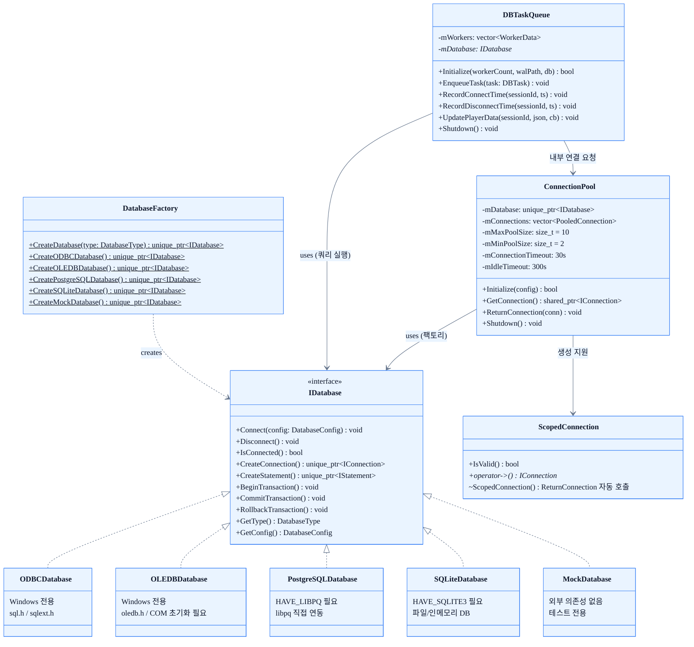

# 05. 데이터베이스

## 개요

ServerEngine의 데이터베이스 레이어는 백엔드 구현과 호출부를 완전히 분리한다.
`IDatabase` 추상 인터페이스가 연결 수명·객체 팩토리 역할을 담당하고, `DatabaseFactory`가 `DatabaseType` enum 값 하나로 구체 구현을 생성한다.
`ConnectionPool`은 스레드 안전한 대여·반납(Borrow/Return) 패턴으로 연결을 재사용하고, `DBTaskQueue`는 게임 로직 스레드와 DB 처리를 분리하는 비동기 큐 역할을 한다.

| 구성 요소 | 역할 |
|---|---|
| `IDatabase` | 연결 관리·객체 팩토리 추상 인터페이스 |
| `DatabaseFactory` | DatabaseType → 구체 IDatabase 인스턴스 생성 |
| `ConnectionPool` | 연결 재사용 풀 (스레드 안전) |
| `ScopedConnection` | RAII 방식 자동 반납 래퍼 |
| `DBTaskQueue` | 비동기 DB 작업 큐 (TestServer 전용) |

---

## 다이어그램




---

## 상세 설명

### IDatabase 인터페이스

`IDatabase`는 데이터베이스 백엔드와 독립적인 추상 인터페이스이다.
**연결 수명 관리**와 **객체 팩토리** 두 가지 역할만 담당하며, 실제 쿼리 실행은 `IStatement`에 위임하여 책임을 분리한다.

```
Network::Database::IDatabase
├── Connect(config)    — 백엔드 연결 수립
├── Disconnect()       — 연결 해제
├── IsConnected()      — 연결 상태 조회
├── CreateConnection() — 독립 수명의 IConnection 반환 (ConnectionPool에서 사용)
├── CreateStatement()  — 내부 연결을 보유하는 단발성 IStatement 반환
├── BeginTransaction() / CommitTransaction() / RollbackTransaction()
│     주의: 트랜잭션 상태는 connection 단위이므로
│           IConnection::BeginTransaction() 사용을 권장
├── GetType()          — DatabaseType 열거값 반환
└── GetConfig()        — 현재 설정 반환
```

> **Execute / Query 위임 구조:** `IDatabase`는 SQL 실행 메서드를 직접 노출하지 않는다.
> `CreateStatement()`로 `IStatement`를 얻은 뒤 `IStatement::Execute()` / `IStatement::Query()`를 호출하는 것이 이 계층의 Execute/Query 진입점이다.
> 이 분리를 통해 파라미터 바인딩·결과셋 반복을 인터페이스에서 일관되게 처리할 수 있다.

### DatabaseFactory

`DatabaseFactory::CreateDatabase(type)` 정적 메서드 하나로 모든 백엔드 생성을 캡슐화한다.
호출부가 `ODBCDatabase`·`SQLiteDatabase` 등 구체 타입을 직접 포함하지 않으므로 플랫폼 종속 헤더(`windows.h`, `sql.h` 등)가 호출부로 누출되지 않는다.

#### 플랫폼·빌드 조건

| DatabaseType | 빌드 조건 | 비고 |
|---|---|---|
| `ODBC` / `MySQL` | `_WIN32` 필요 | MySQL은 ODBC 백엔드로 라우팅됨 |
| `OLEDB` | `_WIN32` 필요 | COM 초기화(COINIT_MULTITHREADED) 필요 |
| `PostgreSQL` | `HAVE_LIBPQ` + libpq 링크 필요 | 미충족 시 `CreateDatabase()` 즉시 예외 발생 |
| `SQLite` | `HAVE_SQLITE3` + sqlite3 링크 필요 | 스텁 존재 — 미충족 시 `Connect()` 호출 시 예외 지연 |
| `Mock` | 조건 없음 | 항상 사용 가능 |

### 지원 백엔드 목록

| 백엔드 | 특징 |
|---|---|
| **ODBC** | Windows 전용; DSN 설정이 있는 모든 DB(MySQL·SQL Server 등)에 범용 사용 |
| **OLEDB** | Windows 전용; SQL Server 특화 기능(서버 커서 등) 지원, COM 초기화 필요 |
| **PostgreSQL** | libpq 직접 연동으로 크로스 플랫폼 지원; `PQexecParams` 바이너리 바인딩으로 SQL 인젝션 차단 |
| **SQLite** | 외부 서버 없이 단일 파일/인메모리 동작; 로컬 캐시·설정 저장에 적합 |
| **Mock** | 외부 의존성 전혀 없음; 테스트 및 스키마 부트스트랩 통과용 |

### ConnectionPool

`ConnectionPool`은 `IConnectionPool` 인터페이스를 스레드 안전하게 구현한다.

#### 풀 설정 기본값

| 설정 | 기본값 | 설명 |
|---|---|---|
| `mMaxPoolSize` | 10 | 동시 active 연결 상한; 초과 시 타임아웃까지 블록 |
| `mMinPoolSize` | 2 | 초기화 시 미리 생성하는 연결 수 (워밍업) |
| `mConnectionTimeout` | 30초 | `GetConnection()` 최대 대기 시간 |
| `mIdleTimeout` | 300초 | 유휴 연결 회수 기준 경과 시간 (`mMinPoolSize` 미만으로는 회수 안 함) |

#### 대여·반납(Borrow/Return) 패턴

```
pool.Initialize(config)          // DatabaseFactory로 백엔드 생성, mMinPoolSize 연결 워밍업
  │
  ├─ GetConnection()             // 사용 가능 연결 없으면 mCondition 대기 (최대 mConnectionTimeout)
  │     Shutdown() 후 호출 시 DatabaseException 발생
  │
  ├─ ReturnConnection(conn)      // 반납 후 mCondition.notify_one()
  │
  └─ Shutdown()                  // 최대 5초 대기 후 강제 종료
```

**스레드 안전 보장 방식:**
- `mMutex` + `mCondition`: 대여 대기 및 반납 알림 직렬화
- `mInitialized`, `mActiveConnections`: `std::atomic` — 락 없이 빠른 상태 확인 가능
- `ClearLocked()`: `mMutex`를 이미 보유한 호출자만 사용 — 비재귀 mutex 재진입 데드락 방지

#### ScopedConnection

`ScopedConnection`은 RAII 방식으로 `GetConnection()` 결과를 감싸 스코프 종료 시 `ReturnConnection()`을 자동 호출한다.
`GetConnection()`이 `nullptr`를 반환할 수 있으므로 사용 전 반드시 `IsValid()`로 확인한다.

```cpp
auto sc = ScopedConnection(pool.GetConnection(), &pool);
if (sc.IsValid()) {
    sc->Execute(...);
}
// 스코프 종료 시 자동으로 ReturnConnection() 호출
```

---

## TestServer 비동기 DB 처리 흐름

TestServer는 IOCP 완료 스레드를 블로킹하지 않기 위해 `DBTaskQueue`를 통해 DB 작업을 비동기로 처리한다.

```
IOCP 완료 스레드 (이벤트 핸들러)
  │
  │  OnConnect / OnDisconnect / OnReceive
  │
  ▼
DBTaskQueue::EnqueueTask(DBTask)
  │
  │  sessionId % workerCount 로 워커 선택 (키 친화도 라우팅)
  │  동일 세션 → 항상 같은 워커 → per-session FIFO 보장
  │
  ▼
WorkerThread::ProcessTask(task)      [워커 스레드, FIFO dequeue]
  │
  ├─ HandleRecordConnectTime()
  ├─ HandleRecordDisconnectTime()
  └─ HandleUpdatePlayerData()
        │
        ▼
     IDatabase::Execute / IStatement::Execute
        │
        ▼
     callback(success, result)       [선택적, nullptr 가능]
        │
        ▼
     WAL::WalWriteDone(seq)          [크래시 복구용 WAL 완료 마킹]
```

#### DBTask 타입

| DBTaskType | 설명 |
|---|---|
| `RecordConnectTime` | 클라이언트 접속 시간 기록 |
| `RecordDisconnectTime` | 클라이언트 접속 종료 시간 기록 |
| `UpdatePlayerData` | 플레이어 데이터 업데이트 (JSON 페이로드) |

#### WAL (Write-Ahead Log)

`DBTaskQueue`는 크래시 복구를 위해 WAL 파일을 유지한다.
작업 처리 전 `P|TYPE|SESSIONID|SEQ|DATA` 레코드를 기록하고, 완료 후 `D|SEQ`를 기록한다.
서버 재시작 시 `D` 없는 `P` 레코드를 재처리(recover)하여 데이터 유실을 방지한다.

---

## 관련 코드 포인트

| 파일 | 역할 |
|---|---|
| `Server/ServerEngine/Interfaces/IDatabase.h` | IDatabase 추상 인터페이스 정의 |
| `Server/ServerEngine/Interfaces/DatabaseType_enum.h` | DatabaseType 열거형 (ODBC·OLEDB·MySQL·PostgreSQL·SQLite·Mock) |
| `Server/ServerEngine/Database/DatabaseFactory.h` / `.cpp` | DatabaseType → IDatabase 인스턴스 생성, 플랫폼 조건부 분기 |
| `Server/ServerEngine/Database/ConnectionPool.h` | 스레드 안전 연결 풀, ScopedConnection RAII 래퍼 |
| `Server/TestServer/include/DBTaskQueue.h` | 비동기 DB 작업 큐, WAL 크래시 복구, 키 친화도 라우팅 |
| `Server/TestServer/src/DBTaskQueue.cpp` | DBTaskQueue 구현 (핸들러·WAL I/O) |
