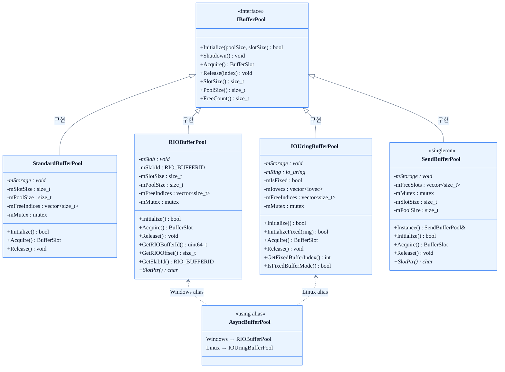

# 06. 버퍼 및 메모리

## 개요

서버 엔진은 네트워크 I/O 경로에서 발생하는 힙 할당 비용을 제거하기 위해 **사전 할당 슬랩(slab) 풀** 방식을 사용한다. 고정 크기 슬롯(slot)으로 분할된 연속 메모리 블록을 미리 할당하고, `Acquire()` / `Release()` 인터페이스를 통해 O(1) 프리리스트 스택으로 슬롯을 대여·반납한다.

모든 구현체는 `IBufferPool` 추상 인터페이스를 공유하므로, 상위 레이어(세션, I/O 프로바이더)는 플랫폼 세부 사항을 알 필요 없이 동일한 인터페이스로 버퍼를 다룬다.

| 구현체 | 플랫폼 | 메모리 할당 | 커널 등록 | 특징 |
|---|---|---|---|---|
| `StandardBufferPool` | 크로스 플랫폼 | `_aligned_malloc` / `posix_memalign` | 없음 | 범용, 등록 비용 없음 |
| `RIOBufferPool` | Windows 8+ | `VirtualAlloc` | `RIORegisterBuffer` 1회 | per-op pin 비용 없음 |
| `IOUringBufferPool` | Linux | `posix_memalign` | `io_uring_register_buffers` | zero-copy 고정 버퍼 |
| `SendBufferPool` | Windows (IOCP) | `_aligned_malloc` | 없음 | 싱글턴, 송신 전용 |

`AsyncBufferPool`은 `using` alias로, Windows에서는 `RIOBufferPool`, Linux에서는 `IOUringBufferPool`을 각 플랫폼 헤더에서 자동으로 선택한다.

---

## 다이어그램





---

## 상세 설명

### BufferSlot

`IBufferPool::Acquire()`가 반환하는 경량 핸들이다.

```cpp
struct BufferSlot {
    void*  ptr      = nullptr; // 슬롯 메모리 포인터 (nullptr → 풀 소진)
    size_t index    = 0;       // Release() 호출용 슬롯 인덱스
    size_t capacity = 0;       // 슬롯 크기 (바이트)
};
```

- `ptr == nullptr`이면 풀이 소진된 상태임을 의미한다.
- `Release(index)`로 슬롯을 반납할 때 `ptr`가 아닌 `index`를 사용한다.

---

### IBufferPool

**파일:** `Core/Memory/IBufferPool.h`

플랫폼 독립적인 순수 가상 인터페이스. 모든 버퍼 풀 구현체의 공통 계약을 정의한다.

- `Initialize(poolSize, slotSize)` — 슬랩 메모리를 할당하고 프리리스트를 초기화한다.
- `Shutdown()` — 메모리를 해제하고 커널 등록을 취소한다.
- `Acquire()` — 프리리스트에서 슬롯 하나를 꺼내 `BufferSlot`으로 반환한다.
- `Release(index)` — 사용이 끝난 슬롯을 프리리스트에 반납한다.

**설계 원칙:** 플랫폼별 헬퍼(RIO 버퍼 ID, io_uring 고정 버퍼 인덱스 등)는 `IBufferPool`에 가상 메서드로 추가하지 않는다. 해당 기능이 필요한 코드(예: `RIOAsyncIOProvider`)는 구체 타입(`RIOBufferPool`)으로 직접 접근하여 가상 디스패치 오버헤드를 제거한다.

---

### StandardBufferPool

**파일:** `Core/Memory/StandardBufferPool.h`

크로스 플랫폼 정렬 할당 풀. 커널 등록이 없어 단순하고 이식성이 높다.

- **메모리 할당:** Windows에서는 `_aligned_malloc`, Linux/macOS에서는 `posix_memalign`을 사용하며 4096바이트 정렬을 보장한다.
- **프리리스트:** `std::vector<size_t>` 스택(후입선출). `mMutex`로 스레드 안전성을 보장한다.
- **용도:** RIO/io_uring를 사용하지 않는 환경, 또는 커널 등록이 필요 없는 수신 버퍼 풀.

---

### RIOBufferPool

**파일:** `Core/Memory/RIOBufferPool.h` (Windows 전용, `#ifdef _WIN32`)

Windows Registered I/O(RIO) API를 활용하는 고성능 풀.

- **메모리 할당:** `VirtualAlloc`으로 연속 슬랩을 페이지 단위로 할당한다.
- **1회 등록:** `RIORegisterBuffer`로 슬랩 전체를 커널에 한 번만 등록한다. 이후 각 I/O 연산은 `RIO_BUFFERID` + 슬롯 오프셋(`index × slotSize`)으로 슬롯을 참조하므로, per-op 페이지 핀(pin) 비용이 발생하지 않는다.
- **확장 메서드 (비가상):**
  - `GetSlabId()` — 슬랩 전체의 단일 `RIO_BUFFERID` 반환.
  - `GetRIOOffset(index)` — 슬롯의 슬랩 내 바이트 오프셋 계산.
  - `SlotPtr(index)` — 슬롯의 실제 메모리 포인터 반환.

**AsyncBufferPool alias:** Windows 플랫폼 헤더에서 `using AsyncBufferPool = RIOBufferPool;`로 정의된다.

---

### IOUringBufferPool

**파일:** `Core/Memory/IOUringBufferPool.h` (Linux 전용, `#if defined(__linux__)`)

Linux io_uring의 고정 버퍼(fixed buffer) 기능을 활용하는 풀.

- **일반 모드 (`Initialize`):** `posix_memalign`으로 슬랩을 할당하되 io_uring 등록 없이 동작한다. 비고정 버퍼 모드 또는 링 초기화 이전 단계에서 사용한다.
- **고정 버퍼 모드 (`InitializeFixed`):** `posix_memalign` 할당 후 `io_uring_register_buffers`를 호출하여 슬랩을 커널에 등록한다. 이후 I/O 연산에서 zero-copy 전송이 가능하다. `io_uring` 인스턴스는 외부 소유이므로, 풀보다 오래 살아야 한다.
- **확장 메서드 (비가상):**
  - `GetFixedBufferIndex(index)` — 등록된 버퍼의 io_uring 인덱스 반환.
  - `IsFixedBufferMode()` — 현재 고정 버퍼 모드 활성 여부 확인.

**AsyncBufferPool alias:** Linux 플랫폼 헤더에서 `using AsyncBufferPool = IOUringBufferPool;`로 정의된다.

---

### AsyncBufferPool (using alias)

`AsyncBufferPool`은 독립 클래스가 아닌 `using` 별칭이다. 각 플랫폼 헤더에 정의되며, 상위 코드는 플랫폼을 구분하지 않고 `AsyncBufferPool`이라는 단일 이름으로 최적화된 구현체를 사용할 수 있다.

```
Windows (RIOBufferPool.h)  → using AsyncBufferPool = RIOBufferPool;
Linux   (IOUringBufferPool.h) → using AsyncBufferPool = IOUringBufferPool;
```

---

### SendBufferPool

**파일:** `Network/Core/SendBufferPool.h` (Windows 전용, `#ifdef _WIN32`)

IOCP 송신 경로 전용 풀. `IBufferPool`을 구현하는 싱글턴이다.

- **목적:** TCP 송신마다 발생하는 힙 할당을 제거하고, 64바이트 정렬된 슬롯으로 캐시 효율을 높인다.
- **메모리 할당:** `_aligned_malloc`으로 `poolSize × slotSize` 바이트 연속 슬랩을 64바이트 정렬 할당한다.
- **프리리스트:** `std::vector<size_t>` 스택(후입선출). `back()`/`pop_back()`으로 대여, `push_back()`으로 반납한다.
- **싱글턴:** `SendBufferPool::Instance()`로 접근. 소멸자에서 `Shutdown()`을 자동 호출한다.
- **위치:** Memory 레이어가 아닌 Network 레이어(`Network::Core`)에 위치하며, IOCP 세션의 송신 흐름과 밀접하게 결합되어 있다.

---

## 관련 코드 포인트

| 파일 | 역할 |
|---|---|
| `Core/Memory/IBufferPool.h` | 추상 인터페이스 및 `BufferSlot` 구조체 정의 |
| `Core/Memory/StandardBufferPool.h` | 크로스 플랫폼 정렬 풀 선언 |
| `Core/Memory/RIOBufferPool.h` | Windows RIO 사전 등록 풀 선언 |
| `Core/Memory/IOUringBufferPool.h` | Linux io_uring 고정 버퍼 풀 선언 |
| `Network/Core/SendBufferPool.h` | IOCP 송신 전용 싱글턴 풀 선언 |
| `Platforms/Windows/RIOAsyncIOProvider.h` | `RIOBufferPool`(AsyncBufferPool) 구체 타입 직접 사용 |
