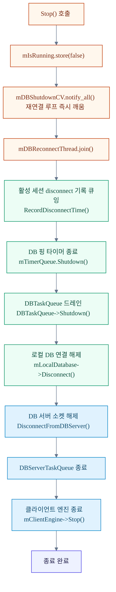

# 07. 종료 및 재연결

## 개요

TestServer는 `Stop()` 호출 시 데이터 손실 없이 안전하게 종료되도록 설계된 Graceful Shutdown 순서를 따른다.
또한 TestServer ↔ TestDBServer 간 TCP 연결이 끊기면 지수 백오프 재연결 루프가 자동으로 복구를 시도한다.

---

## 1. TestServer::Stop() 종료 순서

### 단계별 설명

| 단계 | 작업 | 상세 |
|------|------|------|
| **0** | 종료 플래그 설정 | `mIsRunning.store(false)` |
| **1** | DB 재연결 루프 깨움 및 join | `mDBShutdownCV.notify_all()` → `mDBReconnectThread.join()` |
| **2** | 활성 세션 disconnect 기록 큐잉 | `RecordDisconnectTime()` 호출 — 큐 드레인 전에 먼저 넣어 마지막 이벤트 누락 방지 |
| **3** | DB 핑 타이머 종료 | `mTimerQueue.Cancel(mDBPingTimer)` → `mTimerQueue.Shutdown()` |
| **4** | DBTaskQueue 드레인 | `DBTaskQueue->Shutdown()` — 로컬 DB 연결이 살아있는 동안 대기 작업 완료 |
| **5** | 로컬 DB 해제 | `mLocalDatabase->Disconnect()` — 큐가 완전히 비워진 후 해제 |
| **6** | DB 서버 소켓 해제 | `DisconnectFromDBServer()` — `WSACleanup()` 이전에 반드시 먼저 해제 |
| **7** | DBServerTaskQueue 종료 | `mDBServerTaskQueue->Shutdown()` |
| **8** | 클라이언트 엔진 종료 | `mClientEngine->Stop()` — IOCP/RIO 종료 및 `WSACleanup()` 포함 |

> **주의**: 6단계에서 `DisconnectFromDBServer()`를 `mClientEngine->Stop()` 이전에 호출해야 한다.
> `Stop()`이 `WSACleanup()`을 호출하면 `mDBServerSocket`이 무효화되어 DBRecvLoop에서 `WSAECONNRESET(10054)`이 발생한다.

참고 코드: `Server/TestServer/src/TestServer.cpp:268`

### Mermaid 다이어그램





---

## 2. DB 재연결 루프 (지수 백오프)

TestServer(Windows)는 TestDBServer와의 TCP 연결이 끊기면 `DBReconnectLoop()`를 별도 스레드로 실행한다.

### 백오프 정책

| 에러 종류 | 대기 전략 | 설명 |
|-----------|-----------|------|
| **일반 에러** | 지수 백오프 | `1s → 2s → 4s → 8s → 16s → … → max 30s` |
| **WSAECONNREFUSED (10061)** | 1s 고정 간격 | DB 서버가 재기동 중인 경우 빠른 재감지를 위해 백오프 증가 없음 |

```
초기 delayMs = 1000ms

연결 실패 시:
  if lastError == WSAECONNREFUSED:
      delayMs = 1000ms  (고정)
  else:
      delayMs = min(delayMs * 2, 30000ms)
```

### condition_variable 기반 즉시 깨우기

재연결 대기는 `sleep_for` 대신 `mDBShutdownCV.wait_for()`를 사용한다.
`Stop()` 호출 시 `mDBShutdownCV.notify_all()`이 즉시 대기를 해제하여 빠른 종료가 가능하다.

```cpp
// TestServer.cpp:716 — CV 기반 interruptible wait
std::unique_lock<std::mutex> lock(mDBShutdownMutex);
mDBShutdownCV.wait_for(lock,
    std::chrono::milliseconds(delayMs),
    [this] { return !mIsRunning.load(); });
```

참고 코드:
- 재연결 루프 시작: `Server/TestServer/src/TestServer.cpp:697`
- 에러 분기 (`WSAECONNREFUSED` 처리): `Server/TestServer/src/TestServer.cpp:737`

---

## 3. 운영자 체크리스트

- 종료 로그에 `DB task queue statistics - Processed: N, Failed: M`가 출력되는지 확인
- `Queued disconnect records during shutdown: N`이 필요 시 출력되는지 확인
- DB 서버 재기동 직후 로그에서 `attempt #`, `delay`, `CONNREFUSED` 메시지를 확인
- 장애 분석 시 `DB reconnected successfully after N attempt(s)` 로그로 복구 시점 파악

## 4. 개발자 체크리스트

- 종료 순서 변경 시 소켓 무효화 순서와 큐 드레인 순서를 같이 검토
- 새 스레드 추가 시 `Stop()`에 interrupt + join 경로를 반드시 추가
- `WSAECONNREFUSED` 예외 분기를 유지하여 DB 서버 재기동 복원성 보장
- 재연결 최대 지연(30s) 조정 시 운영 알림 주기와 함께 조정
- 재연결 대기 로직은 `sleep_for` 대신 CV 기반 interruptible wait 유지
