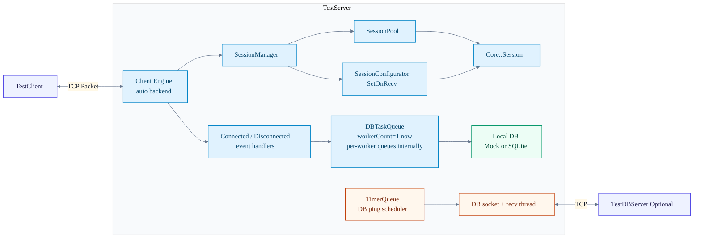

# 01. Overall Architecture

이 페이지는 현재 `TestServer` 실행 경로를 한 장으로 요약한다.
중요한 기준은 "`ClientSession` 중심 설명"이 아니라
"`SessionPool` + `SessionManager` + `TestServer` 이벤트 핸들러" 구조라는 점이다.

## 정적 이미지 (SVG)

## 전체 구조

## 빠르게 보기

1. 세션 객체는 현재 `SessionPool`의 `Core::Session`으로 생성된다.
2. recv 콜백은 `SetSessionConfigurator()`가 `SetOnRecv()`로 붙인다.
3. 접속/종료 DB 기록은 `TestServer` 이벤트 핸들러가 `DBTaskQueue`에 enqueue 한다.
4. `DBTaskQueue`는 내부적으로 워커별 독립 큐를 가지지만, 현재 `TestServer` 설정은 workerCount=1 이다.
5. DB 서버 ping은 `DBPingLoop`가 아니라 `TimerQueue::ScheduleRepeat()`로 구동된다.

## 개발 체크

1. 문서에 "세션 팩토리로 `ClientSession` 생성"이라고 쓰지 않는다.
2. 문서에 `DBTaskQueue`를 "단일 공유 큐"로 고정 설명하지 않는다.
3. 현재 설정값(workerCount=1)과 구현 구조(워커별 독립 큐)는 분리해서 적는다.
4. ping 반복 경로는 `TimerQueue` 기준으로 설명한다.

## 운영 체크

1. 접속/종료 기록이 어긋나면 `TestServer` 이벤트 로그와 `DBTaskQueue` 로그를 같이 본다.
2. DB 지연이 보이면 `GetQueueSize()`와 WAL 복구 로그를 먼저 확인한다.
3. graceful shutdown 검증 시 큐 드레인 이후 로컬 DB disconnect 순서를 확인한다.

## 참고 코드

- `Server/TestServer/src/TestServer.cpp`
- `Server/ServerEngine/Network/Core/SessionManager.cpp`
- `Server/ServerEngine/Network/Core/SessionPool.cpp`
- `Server/TestServer/src/DBTaskQueue.cpp`

검증일: 2026-03-15
