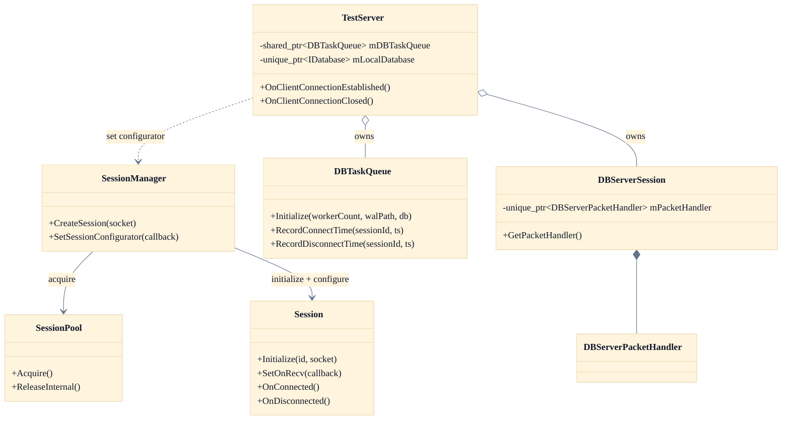

# 02. Session Layer

이 페이지는 현재 활성 세션 경로와 관련 객체 책임을 정리한다.
핵심은 "기본 런타임 세션은 `Core::Session`"이라는 점이다.

## 정적 이미지 (SVG)

## 세션 계층도

## 핵심 책임

1. `SessionPool`: 재사용 가능한 `Core::Session` 보관
2. `SessionManager`: 세션 생성, 초기화, configurator 적용, 등록/조회
3. `TestServer`: 이벤트 수신, DBTaskQueue 소유, 로컬 DB/원격 DB 수명주기 관리
4. `DBTaskQueue`: 비동기 DB 작업 큐와 WAL 복구 담당
5. `DBServerSession`: TestDBServer와의 소켓 통신 담당

## 현재 활성 경로

1. 플랫폼 엔진이 `SessionManager::CreateSession()`을 호출한다.
2. `SessionManager`는 `SessionPool`에서 `Core::Session`을 획득한다.
3. `SetSessionConfigurator()`에 등록된 콜백이 `SetOnRecv()`를 붙인다.
4. 접속/종료 DB 기록은 세션 객체 내부가 아니라 `TestServer` 이벤트 핸들러가 enqueue 한다.

## `ClientSession`에 대한 현재 판단

- `ClientSession` 클래스는 저장소에 남아 있다.
- `weak_ptr<DBTaskQueue>`와 비동기 기록 메서드 구현도 유지되어 있다.
- 하지만 현재 기본 세션 생성 경로는 `ClientSession`을 사용하지 않는다.

따라서 문서에서 `ClientSession`을 설명할 때는 다음 중 하나로 명확히 써야 한다.

- 현재 활성 경로가 아님
- 참고용/레거시 구현

## 설계상 중요한 점

1. `SessionFactory` 기반 설명은 현재 기준 문서가 아니다.
2. recv 콜백은 configurator가 첫 recv 전에 붙여 준다.
3. `DBTaskQueue`는 현재 설정이 1 worker일 뿐, 내부 구현은 워커별 독립 큐다.
4. 접속/종료 기록의 진입점은 `ClientSession`보다 `TestServer` 이벤트 핸들러가 더 중요하다.

## 개발 체크

1. 세션 생성 설명에는 `CreateSession()`과 `SetSessionConfigurator()`를 쓴다.
2. DB 기록 설명에는 `OnClientConnectionEstablished()` / `OnClientConnectionClosed()`를 쓴다.
3. `ClientSession`을 기준 문서로 삼지 않는다.

## 운영 체크

1. 세션 생성 문제는 `SessionPool` 고갈 여부와 `SessionManager` 로그를 먼저 본다.
2. 접속/종료 DB 기록 문제는 `TestServer` 이벤트 로그와 `DBTaskQueue` 로그를 같이 본다.

## 참고 코드

- `Server/ServerEngine/Network/Core/SessionManager.h`
- `Server/ServerEngine/Network/Core/SessionManager.cpp`
- `Server/ServerEngine/Network/Core/SessionPool.h`
- `Server/ServerEngine/Network/Core/SessionPool.cpp`
- `Server/TestServer/include/TestServer.h`
- `Server/TestServer/src/TestServer.cpp`

검증일: 2026-03-15
