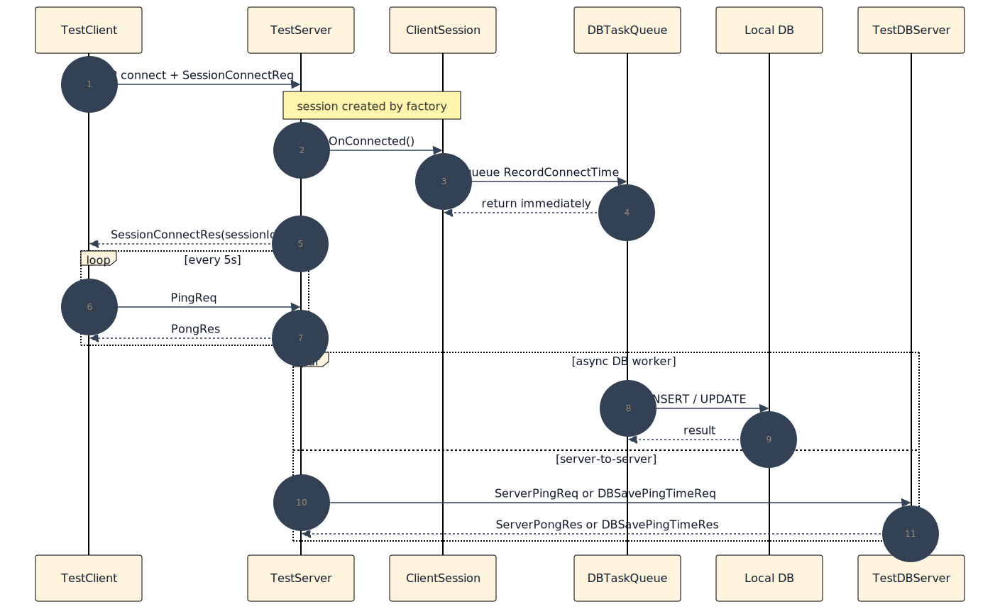
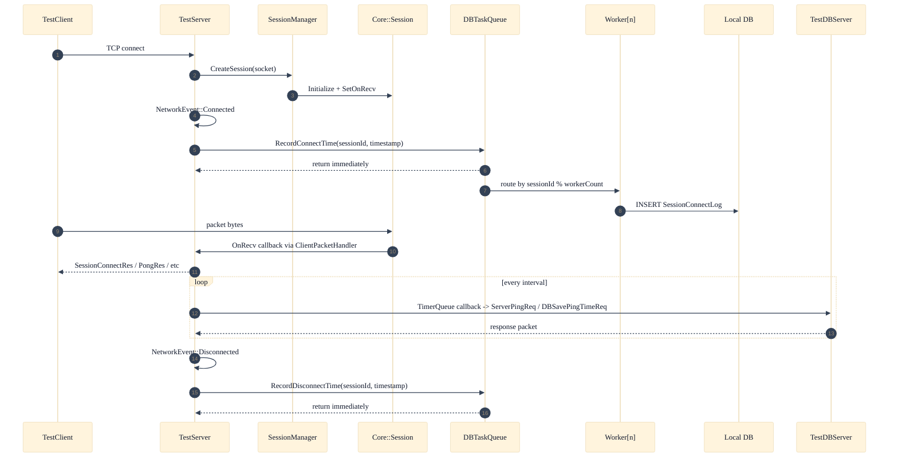

# 03. Packet and AsyncDB Flow

이 페이지는 현재 패킷 처리 경로와 비동기 DB 기록 경로가 어디서 갈라지는지 보여 준다.

## 정적 이미지 (SVG)

## 연결 / 패킷 / 비동기 DB 흐름

## 흐름 요약

1. 세션 생성은 `SessionManager::CreateSession()`이 처리한다.
2. recv 처리 경로는 세션에 주입된 `SetOnRecv()` 콜백으로 들어간다.
3. 접속/종료 DB 기록 경로는 `TestServer`의 연결 이벤트 핸들러에서 시작한다.
4. `DBTaskQueue`는 세션 ID 기반으로 워커를 선택해 DB 작업을 직렬화한다.
5. 원격 DB 서버 ping은 별도 ping 루프가 아니라 `TimerQueue`가 반복 실행한다.

## 개발 체크

1. 패킷 경로와 DB 기록 경로를 같은 메서드 체인으로 설명하지 않는다.
2. `sessionId % workerCount` 라우팅을 빠뜨리지 않는다.
3. `DBPingLoop` 대신 `TimerQueue::ScheduleRepeat()`를 적는다.

## 운영 체크

1. 패킷 응답 지연과 DB 지연은 별도 경로로 봐야 한다.
2. DB 지연이 커져도 enqueue 자체는 즉시 반환되므로 큐 적체와 처리 지연을 분리해서 본다.

## 참고 코드 / 문서

- `Doc/Architecture/AsyncDB.md`
- `Server/TestServer/src/TestServer.cpp`
- `Server/TestServer/src/DBTaskQueue.cpp`
- `Server/ServerEngine/Network/Core/SessionManager.cpp`

검증일: 2026-03-15
