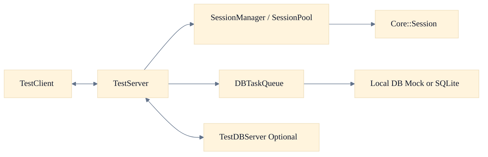

# NetworkModuleTest Server Wiki (Draft)

이 문서는 현재 `TestServer` 구조를 빠르게 이해하기 위한 위키 초안이다.
기준은 "지금 실행되는 코드 경로"다.

## 문서 범위

- TestClient, TestServer, TestDBServer 연결 구조
- 세션 생성과 recv 콜백 주입 방식
- 비동기 DB 기록 경로
- graceful shutdown 순서
- DB 서버 재연결과 ping 스케줄링

## 추천 읽기 순서

1. [[01-Overall-Architecture]]
2. [[02-Session-Layer]]
3. [[03-Packet-and-AsyncDB-Flow]]
4. [[04-Graceful-Shutdown]]
5. [[05-Reconnect-Strategy]]

## 5분 요약

- 세션 생성 경로: `SessionPool` -> `SessionManager::CreateSession()` -> `SetSessionConfigurator()`
- 현재 기본 세션 객체: `Core::Session`
- DB 작업은 `TestServer` 이벤트 핸들러가 `DBTaskQueue`에 비동기로 enqueue
- `DBTaskQueue`는 워커별 독립 큐 구조이며, 현재 런타임 설정은 workerCount=1
- 종료 순서 핵심: disconnect 기록 enqueue -> `DBTaskQueue` 드레인 -> 로컬 DB disconnect -> 엔진 stop
- DB ping 반복 작업은 `TimerQueue::ScheduleRepeat()` 사용

## 페이지 미리보기

## 개발 체크

1. `MakeClientSessionFactory()` 기준 설명은 현재 문서에서 제거한다.
2. `ClientSession`은 활성 경로인지 참고 구현인지 구분해서 적는다.
3. `DBTaskQueue`는 "단일 공유 큐"로 단정하지 않는다.

## 운영 체크

- TestServer 기본 포트: `9000`
- TestDBServer 기본 포트: `8001`
- 기동 순서: `TestDBServer -> TestServer -> TestClient`
- 장애 시 우선 확인: 재연결 로그, `DBTaskQueue` 통계 로그, WAL 복구 로그

검증일: 2026-03-15
