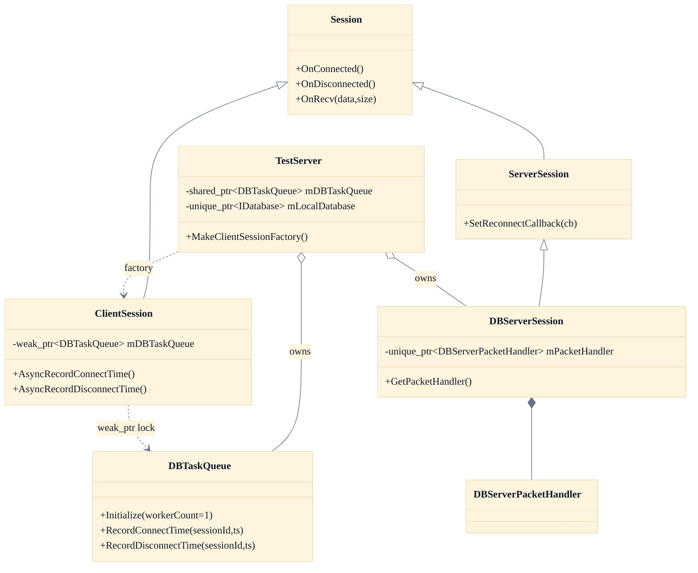

# 02. Session Layer

이 페이지는 세션 클래스 관계와 책임을 빠르게 파악하기 위한 문서입니다.

## 정적 이미지 (SVG)

## 세션 계층도

## 한눈에 보기
1. `ClientSession`: 클라이언트 패킷 처리 + 비동기 DB 작업 요청
2. `ServerSession`: 서버간 통신 공통 베이스 + 재연결 콜백
3. `DBServerSession`: DB 서버 전용 패킷 처리(`DBServerPacketHandler`)
4. `TestServer`: 수명주기/스레드/소켓/DBTaskQueue 소유 및 종료 순서 관리

## 설계상 중요한 점
1. `ClientSession`은 `DBTaskQueue`를 `weak_ptr`로 참조합니다.
2. `DBTaskQueue`는 워커 1개를 기본값으로 유지해 세션별 작업 순서를 보장합니다.
3. 세션 생성은 `MakeClientSessionFactory()` 람다를 통해 주입됩니다.

## 개발자 체크
1. 세션에서 DB 작업이 필요하면 새 API를 `DBTaskQueue`에 추가한 뒤 비동기로 호출합니다.
2. 수명주기 경계(Stop 중 late callback)에서 `weak_ptr.lock()` 실패 처리를 반드시 유지합니다.
3. 서버간 패킷 해석 로직은 `DBServerSession`보다는 `DBServerPacketHandler`로 모읍니다.

## 운영자 체크
1. 접속/종료 로그는 `ClientSession`과 `DBTaskQueue` 로그를 함께 봐야 흐름이 맞습니다.
2. DB 서버 연결이 끊겨도 클라이언트 경로 자체는 계속 동작할 수 있음을 전제로 모니터링합니다.

## 참고 코드
- `Server/TestServer/include/ClientSession.h`
- `Server/TestServer/include/ServerSession.h`
- `Server/TestServer/include/DBServerSession.h`
- `Server/TestServer/include/TestServer.h`

검증일: 2026-02-20
