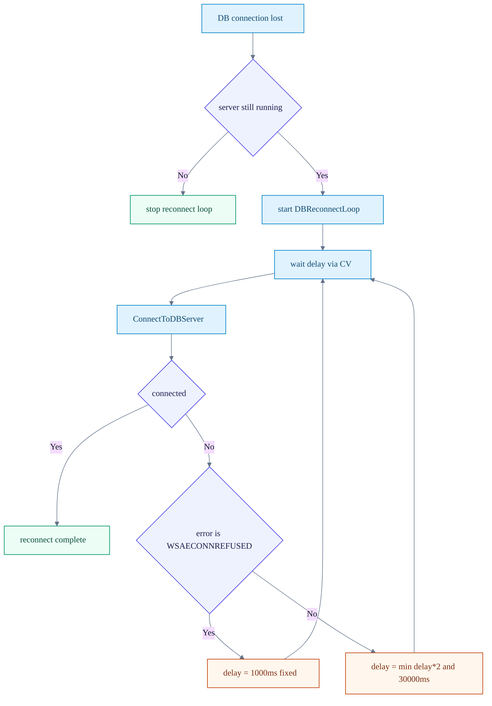

# 05. Reconnect Strategy

이 페이지는 TestServer와 DBServer 간 자동 재연결 정책을 설명합니다.

## 정적 이미지 (SVG)

## 재연결 정책 다이어그램

## 한눈에 보기
1. 기본은 지수 백오프: `1s -> 2s -> 4s -> ... -> max 30s`
2. `WSAECONNREFUSED(10061)`이면 `1s` 고정 간격 재시도
3. `Stop()` 호출 시 CV로 즉시 대기 해제하여 빠르게 종료

## 개발자 체크
1. 에러 코드 분기 로직에서 `WSAECONNREFUSED` 예외 처리를 유지합니다.
2. 재연결 대기 로직은 `sleep_for` 대신 CV 기반 interruptible wait를 유지합니다.
3. 최대 지연(`30s`) 조정 시 운영 알림 주기와 함께 조정합니다.

## 운영 포인트
- DB 서버 재기동 직후 빠른 복구가 필요한 경우 `CONNREFUSED` 분기 유지
- 일반 네트워크 장애는 과도한 재시도 폭주를 막기 위해 지수 백오프 유지
- 장애 분석 시 `attempt #`, `delay`, `last error` 로그를 같이 확인

## 참고 코드
- `Server/TestServer/src/TestServer.cpp`

검증일: 2026-02-20
