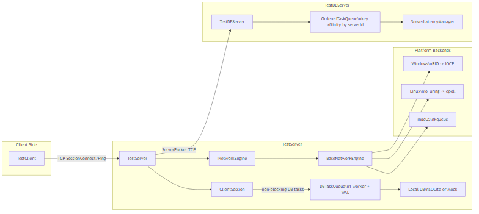
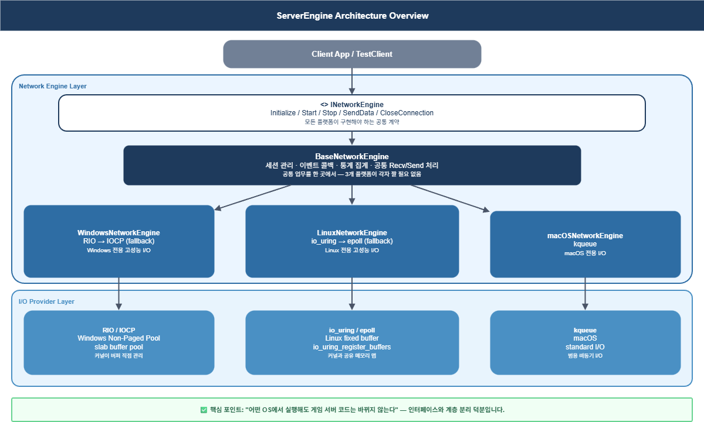
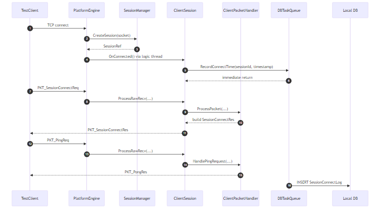
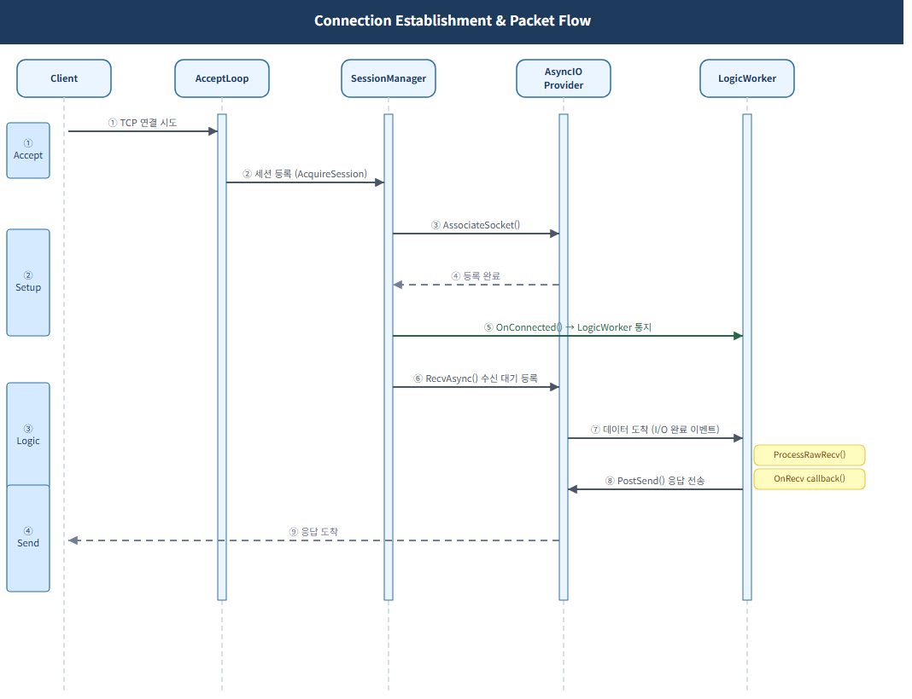
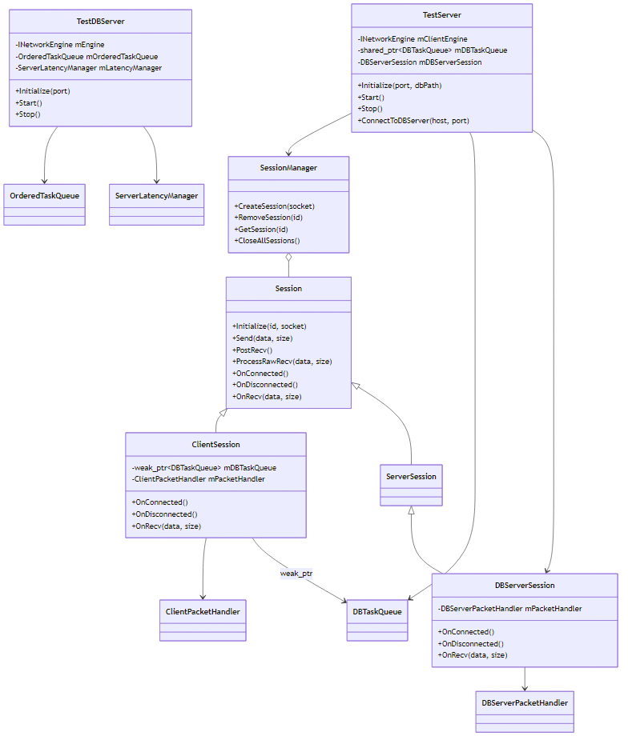
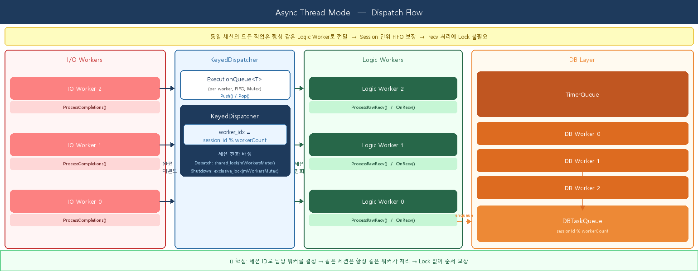
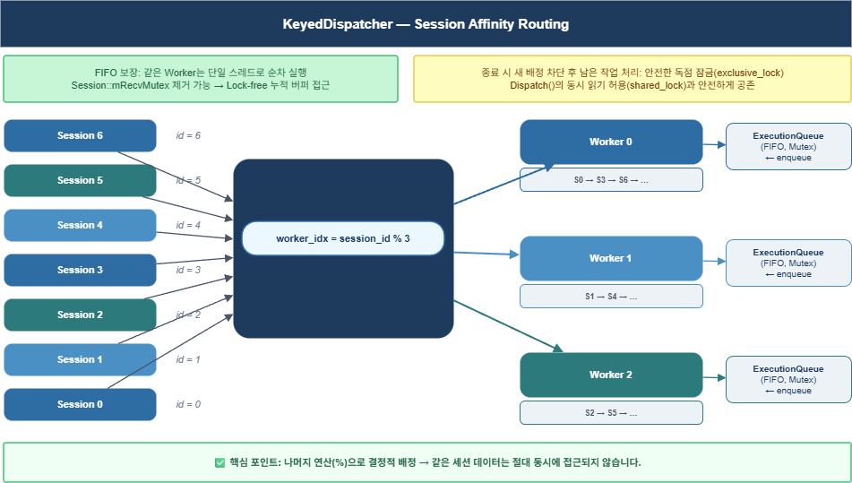
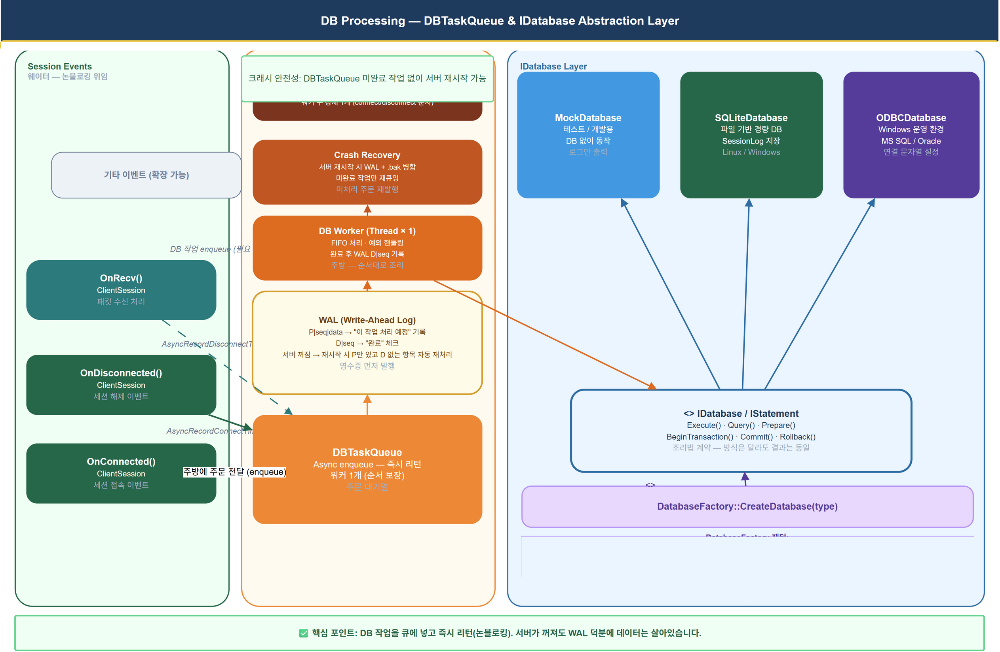

# Network / Async / DB 처리 구조 분석 보고서

- 최초 작성: 2026-02-26
- 최종 업데이트: 2026-03-23
- 기준 리포지토리: `NetworkModuleTest`
- 분석 기준: `ServerEngine`, `TestServer`, `DBServer` 실제 구현 코드
- 목적: 네트워크 처리, 비동기 처리, DB 처리의 현재 구조와 데이터 흐름을 코드 기준으로 정리

---

## 1. 개요

이 보고서는 NetworkModuleTest 프로젝트의 네트워크 처리 구조, 비동기 처리 구조, DB 처리 구조를 코드 수준에서 정리한다. 멀티플랫폼으로서 아키텍처의 각 계층이 어떻게 협력하고, 데이터가 어떤 경로로 흐르며, 비동기·논블로킹 설계가 어떻게 적용되어 있는지를 중심으로 기술한다.

▲ 전체 아키텍처 개요 — INetworkEngine · AsyncIOProvider · 스레드 역할 분리

▲ 아키텍처 계층 구조

### 1.1 3계층 설계 요약

| 계층 | 핵심 컴포넌트 | 역할 요약 |
|------|---------------|-----------|
| 네트워크 | `INetworkEngine` `BaseNetworkEngine` `AsyncIOProvider` | 플랫폼별 I/O 완료 처리, 세션 생성·관리, 송수신 비동기 제공 |
| 비동기 처리 | `ThreadPool` `KeyedDispatcher` `DBTaskQueue` `OrderedTaskQueue` | 로직 워커 스레드 풀, 세션 키 친화도 라우팅, 논블로킹 DB 오프로딩 |
| DB 처리 | `IDatabase` `SQLiteDatabase / MockDatabase` `ServerLatencyManager` | 교체 가능한 DB 추상화, 로컬 SQLite / 테스트 Mock, DBServer 지연 시간 기록 |

### 1.2 플랫폼별 I/O 백엔드

| 플랫폼 | 1순위 백엔드 | 폴백 백엔드 | 비고 |
|--------|-------------|------------|------|
| Windows | RIO (Registered I/O) | IOCP | WSA 10055 방지를 위한 Slab 풀 |
| Linux | io_uring | epoll | kernel 5.1+ 필요 |
| macOS | kqueue | — | 단일 백엔드 |

---

## 2. 네트워크 처리 구조

네트워크 계층은 `INetworkEngine` 인터페이스와 `AsyncIOProvider` 플랫폼 추상화의 2계층으로 분리된다. 공통 동작(세션 관리, 이벤트 콜백, 통계)은 `BaseNetworkEngine`이 담당하고, 플랫폼 특화 동작(소켓 accept, completion 처리)은 각 플랫폼 구현체가 담당한다.

### 2.1 계층 구조

| 컴포넌트 | 역할 | 주요 코드 포인트 |
|----------|------|----------------|
| `INetworkEngine` | 외부 API 인터페이스 `Initialize / Start / Stop` `SendData / CloseConnection` | `Network/Core/NetworkEngine.h:72` |
| `BaseNetworkEngine` | 공통 구현: 세션 조회·제거, 이벤트 콜백 등록, 통계 집계 | `Network/Core/BaseNetworkEngine.cpp:28` |
| `AsyncIOProvider` | 플랫폼 I/O 추상화 `RecvAsync / SendAsync` `AssociateSocket` | `Network/Core/AsyncIOProvider.cpp:74` |
| Platform Engine | 소켓 accept 루프, Completion 처리 (Windows / Linux / macOS) | `Network/Platforms/WindowsNetworkEngine.cpp:128` |

### 2.2 연결 수립 → 세션 생성 흐름

플랫폼 `AcceptLoop()`에서 새 연결을 처리하는 공통 흐름은 아래와 같다.

1. `accept()`로 소켓 수락
2. `SessionManager::CreateSession()`으로 세션 객체 생성
3. `AsyncIOProvider::AssociateSocket()`으로 I/O 백엔드 연동
4. 로직 스레드풀에서 `OnConnected + Connected` 이벤트 비동기 실행
5. 첫 번째 Recv 등록 (수신 루프 시작)

▲ 클라이언트 생명주기 시퀀스 — 접속 수락 → 핸드셰이크 → ping/pong → 종료

▲ 연결 수립 시퀀스

### 2.3 Session 구조

`Session`은 네트워크 계층의 핵심 단위다. 연결 상태, 송수신 큐, `AsyncScope`를 하나의 객체로 관리하며, 동기화는 역할별로 분리된 프리미티브가 담당한다.

▲ Session UML — 주요 멤버 변수 및 동기화 프리미티브 구조

| 동기화 프리미티브 | 보호 대상 | 설계 포인트 |
|------------------|----------|------------|
| `mSendMutex` (mutex) | `mSendQueue · mAsyncProvider` | 락 내 `shared_ptr` 스냅샷만 복사 후 즉시 해제, 실제 I/O 호출은 락 외부에서 수행 |
| `mState` (atomic, acq_rel) | 연결 상태 enum | `exchange`로 `Close()` TOCTOU 이중 닫기 방지 |
| `mSocket` (atomic, acq_rel) | 소켓 핸들 | Close/Send 간 race 방지 |
| `mIsSending` (atomic CAS) | 이중 전송 방지 | `compare_exchange_strong(false→true)` 한 스레드만 `PostSend()` 진입 보장 |
| `mSendQueueSize` (atomic) | 큐 크기 fast-path 조회 | relaxed read (부정확해도 됨), release store |

### 2.4 수신 처리와 패킷 재조립

수신 완료 이벤트는 `ProcessCompletions()`에서 감지되어 `BaseNetworkEngine::ProcessRecvCompletion()`으로 전달된다. 이후 로직 스레드풀로 넘겨진 `Session::ProcessRawRecv()`에서 TCP 스트림을 재조립한다.

- `PacketHeader(size, id)` 기준으로 완전한 패킷이 조립될 때까지 버퍼 누적
- 유효하지 않은 크기 또는 오버플로우 탐지 시 세션 즉시 종료
- POSIX 경로: `RecvAsync()`를 직접 구동 (`PostRecv()` 미사용)

`Session.cpp:445` — TCP 스트림 재조립 진입점
`BaseNetworkEngine.cpp:255` — 수신 완료 공통 처리

### 2.5 송신 처리

`Session::Send()`는 `SendResult`를 반환해 호출자에게 백프레셔 피드백을 제공한다. `mIsSending` CAS와 `mSendQueueSize` atomic으로 불필요한 락 경쟁과 이중 전송을 방지한다.

| SendResult 값 | 의미 | 호출자 조치 |
|---------------|------|------------|
| `Ok` | 전송 성공 (큐잉 또는 즉시 전송) | 없음 |
| `QueueFull` | 큐 백프레셔 임계값 초과 | 잠시 후 재시도 또는 세션 종료 |
| `NotConnected` | 세션 미연결 | 재시도 금지 |
| `InvalidArgument` | null 또는 최대 크기 초과 패킷 | 재시도 금지 — 호출 측 버그 |

> **참고:** `bytesSent <= 0`인 송신 완료는 `DataSent` 이벤트를 발생시키지 않고 `ProcessErrorCompletion()`으로 라우팅하여 세션을 정상 종료한다. (`BaseNetworkEngine.cpp:ProcessSendCompletion`)

> **참고:** 이벤트 스레드 일관성: `OnDisconnected`는 `CloseConnection()` 경로와 recv 오류 경로 모두 로직 스레드풀로 전달되어 실행된다. 콜백 호출 스레드가 일관하게 유지된다.

### 2.6 에러 처리 통합 (ProcessErrorCompletion)

3개 플랫폼(Windows/Linux/macOS) 에러 완료 경로를 단일 헬퍼로 통합했다. Send/Recv 방향 구분, `AsyncScope` 경유 disconnect, 방향별 통계 집계를 모든 플랫폼에서 일관되게 처리한다.

| 항목 | 내용 |
|------|------|
| 함수 시그니처 | `ProcessErrorCompletion(SessionRef, AsyncIOType, OSError)` |
| 방향별 카운터 | `AsyncIOType::Send` → `mTotalSendErrors++` / `AsyncIOType::Recv` → `mTotalRecvErrors++` / `Statistics::totalErrors = sendErrors + recvErrors` |
| 예상 종료 판별 | `WSAECONNRESET / WSAESHUTDOWN / EPIPE / ECONNRESET / osError==0` → `Logger::Warn` (정상 종료) / 그 외 → `Logger::Error` (비정상) |
| disconnect 경로 | `ProcessRecvCompletion(session, 0, nullptr)` 경유 → `AsyncScope` 경유 `OnDisconnected` — 모든 플랫폼 동일 |
| 코드 포인트 | `BaseNetworkEngine.cpp:ProcessErrorCompletion` |

---

## 3. 비동기 처리 구조

비동기 처리는 I/O 완료 스레드(플랫폼 엔진)와 로직 스레드풀(`KeyedDispatcher`)의 역할 분리를 기반으로 한다. DB 작업은 별도의 논블로킹 큐(`DBTaskQueue`, `OrderedTaskQueue`)로 오프로딩하여 로직 스레드 지연을 최소화한다.

▲ I/O 완료 → 워커 배정 흐름

### 3.1 스레드 역할 분리

| 스레드 종류 | 주체 | 역할 |
|------------|------|------|
| I/O 완료 스레드 | 플랫폼 엔진 (Windows/Linux/macOS) | accept / recv / send 완료 감지, 로직 스레드풀로 패킷 전달 |
| 로직 워커 스레드 | `KeyedDispatcher` | 패킷 처리 · `OnConnected` · `OnDisconnected`, 세션 키 친화도 라우팅 (FIFO 순서 보장) |
| DB 워커 스레드 (TestServer) | `DBTaskQueue` 기본 1개, `-w` 플래그로 설정 (`DEFAULT_TASK_QUEUE_WORKER_COUNT`) | 논블로킹 DB I/O 실행, WAL 영속성 보장, `sessionId % workerCount` 해시 친화도 |
| DB 워커 스레드 (DBServer) | `OrderedTaskQueue` 기본 4개, `-w` 플래그로 설정 (`DEFAULT_DB_WORKER_COUNT`) | serverId 단위 순서 보장, `KeyedDispatcher` 래핑 |
| 재연결 스레드 | TestServer `DBReconnectLoop` | DB 서버 끊김 시 지수 백오프 재시도, `Stop()` 신호 시 즉시 종료 |

> **핵심:** `KeyedDispatcher`는 `sessionId % workerCount`로 항상 같은 워커에 작업을 배분한다. 워커 큐 FIFO와 결합해 세션별 패킷 처리 순서를 보장하며, `Session::mRecvMutex`가 불필요해진다.

### 3.2 DBTaskQueue — 논블로킹 DB 오프로딩 (TestServer)

`TestServer`는 접속/해제 시점을 직접 DB에 기록하지 않고 `DBTaskQueue`에 enqueue한다. DB I/O 지연이 로직 워커를 블로킹하지 않는다. 워커 수는 CLI `-w` 플래그로 설정 가능하며 기본값은 1(`DEFAULT_TASK_QUEUE_WORKER_COUNT`)이다.

- `OnClientConnectionEstablished` → `RecordConnectTime`
- `OnClientConnectionClosed` → `RecordDisconnectTime`
- `sessionId % workerCount` 해시 친화도 — 워커 수와 무관하게 세션별 순서 보장
- 1 워커: 가장 단순, 친화도 계산 불필요
- N 워커: 처리량 향상, 세션별 순서는 해시 친화도로 여전히 보장

> **핵심:** 워커 수를 바꿔도 순서는 깨지지 않는다. 재시작 시 worker count 변경이 안전하다.

`TestServer.cpp:OnClientConnectionEstablished` — 비동기 기록 진입점
`DBTaskQueue.cpp:EnqueueTask` — 작업 enqueue
`DBTaskQueue.cpp:WorkerThreadFunc` — 워커 실행 루프
`NetworkTypes.h:DEFAULT_TASK_QUEUE_WORKER_COUNT` — 기본 워커 수 상수

### 3.3 KeyedDispatcher — 세션 라우팅

`KeyedDispatcher`는 `session_id % workerCount` 해시를 이용해 동일 세션의 모든 작업을 항상 같은 Logic Worker 스레드로 라우팅한다. 이를 통해 세션 단위 FIFO 순서가 락 없이 보장되고, `Session::mRecvMutex`를 제거할 수 있다.

| 항목 | 내용 |
|------|------|
| 배정 공식 | `worker_idx = session_id % workerCount` 결정론적 — 같은 세션은 항상 같은 워커 |
| `Dispatch()` | `shared_lock(mWorkersMutex)` — 다수 I/O 스레드가 동시에 배정 가능 |
| `Shutdown()` | `exclusive_lock(mWorkersMutex)` — 신규 배정 차단 → 남은 작업 완전 드레인 |
| `ExecutionQueue<T>` | 워커당 1개, FIFO 순서 보장 `Push() / Pop()`, `BackpressurePolicy` (`RejectNewest / Block`) |
| `mRecvMutex` 제거 | 같은 세션 recv가 항상 같은 워커 → 동시 접근 구조적 불가능 |

> **핵심:** `Dispatch()`와 `Shutdown()`은 `mWorkersMutex` 공유·독점 잠금 쌍으로 안전하게 공존한다. `Shutdown()` 진입 즉시 신규 dispatch가 차단되므로 in-flight 작업 유실 없이 종료된다.

`Concurrency/KeyedDispatcher.h` — Dispatch / Shutdown 구현
`Concurrency/ExecutionQueue.h` — Push / Pop / BackpressurePolicy

▲ KeyedDispatcher — 세션 친화 라우팅 (session_id % workerCount)

### 3.4 OrderedTaskQueue — DBServer 키 순서 보장

`TestDBServer`는 `serverId` 단위 작업 순서 보장을 위해 `OrderedTaskQueue`를 사용한다. 내부적으로 `KeyedDispatcher`를 래핑하여 같은 key(`serverId`)를 항상 같은 워커로 라우팅한다. 워커 수는 CLI `-w` 플래그로 설정 가능하며 기본값은 4(`DEFAULT_DB_WORKER_COUNT`)이다.

- facade: `OrderedTaskQueue.cpp:Initialize()`
- keyed dispatch: `OrderedTaskQueue.cpp:EnqueueTask()`
- dispatcher 구현: `Concurrency/KeyedDispatcher.h`

`NetworkTypes.h:DEFAULT_DB_WORKER_COUNT` — 기본 워커 수 상수 (기본값 4)
`DBServer/main.cpp:-w 옵션` — 런타임 워커 수 설정

---

## 4. DB 처리 구조

DB 레이어는 `IDatabase / IStatement` 인터페이스 기반으로 구현체를 교체 가능하게 설계되어 있다. `TestServer`는 로컬 SQLite/Mock DB를 `DBTaskQueue`로 비동기 접근하고, `TestDBServer`는 네트워크로 수신한 요청을 `OrderedTaskQueue`를 통해 처리한다.

▲ DB 처리 계층

**IDatabase 추상화 계층**

| 구현체 | 용도 | 코드 포인트 |
|--------|------|------------|
| `MockDatabase` | 단위 테스트 / DB 없는 환경 | `ServerEngine/Database/` |
| `SQLiteDatabase` | 로컬 파일 DB (TestServer) | `ServerEngine/Database/` |
| `ODBCDatabase` | ODBC 지원 DB | `ServerEngine/Database/` |
| `OLEDBDatabase` | Windows OLE DB | `ServerEngine/Database/` |

`IDatabase.h:29` — 인터페이스 정의
`DatabaseFactory.cpp:19` — 팩토리 생성 진입점

### 4.1 TestServer 로컬 DB 경로

`TestServer::Initialize()`에서 설정 값에 따라 DB 구현체를 선택한다.

| 설정 | 선택된 DB | 비고 |
|------|----------|------|
| `dbConnectionString` 비어 있음 | `MockDatabase` | DB 없이 메모리 로그만 |
| `dbConnectionString` 값 있음 | `SQLiteDatabase` | 해당 파일 경로 사용 |

선택된 DB 인스턴스를 `DBTaskQueue`에 주입하고, 큐에서 아래 테이블 존재를 보장한다.

- `SessionConnectLog` — 접속 시각 기록
- `SessionDisconnectLog` — 해제 시각 기록
- `PlayerData` — 플레이어 정보

`TestServer.cpp:81` — DB 선택 및 주입
`DBTaskQueue.cpp:73` — 테이블 보장 (`CREATE TABLE IF NOT EXISTS`)

### 4.2 TestDBServer DB 처리

`TestDBServer`는 `ServerPacketHandler + ServerLatencyManager + OrderedTaskQueue` 조합으로 동작한다.

| 패킷 | 처리 흐름 | 코드 포인트 |
|------|----------|------------|
| `ServerPingReq` | RTT 계산 → `RecordLatency` (메모리) | `ServerPacketHandler.cpp:116` |
| `DBSavePingTimeReq` | `SavePingTime` 실행 → 응답 패킷 전송 | `ServerPacketHandler.cpp:196` |

---

## 5. 주요 참조 파일

### 네트워크 계층

- `Server/ServerEngine/Network/Core/NetworkEngine.h`
- `Server/ServerEngine/Network/Core/BaseNetworkEngine.cpp`
- `Server/ServerEngine/Network/Core/AsyncIOProvider.cpp`
- `Server/ServerEngine/Network/Core/Session.h`
- `Server/ServerEngine/Network/Core/Session.cpp`
- `Server/ServerEngine/Network/Platforms/WindowsNetworkEngine.cpp`
- `Server/ServerEngine/Network/Platforms/LinuxNetworkEngine.cpp`

### 비동기

- `Server/ServerEngine/Utils/NetworkTypes.h` — `DEFAULT_DB_WORKER_COUNT / DEFAULT_TASK_QUEUE_WORKER_COUNT`
- `Server/ServerEngine/Utils/ThreadPool.h`
- `Server/ServerEngine/Concurrency/KeyedDispatcher.h`
- `Server/ServerEngine/Concurrency/AsyncScope.h`
- `Server/TestServer/src/DBTaskQueue.cpp`
- `Server/DBServer/src/OrderedTaskQueue.cpp`

### DB 계층

- `Server/ServerEngine/Interfaces/IDatabase.h`
- `Server/ServerEngine/Database/DatabaseFactory.cpp`
- `Server/DBServer/src/TestDBServer.cpp`
- `Server/DBServer/src/ServerPacketHandler.cpp`
- `Server/DBServer/src/ServerLatencyManager.cpp`

- `Server/TestServer/src/TestServer.cpp`
- `Server/TestServer/src/ClientSession.cpp`
