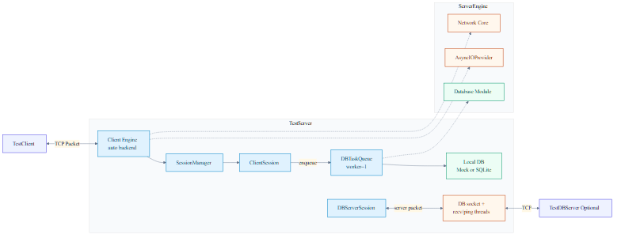
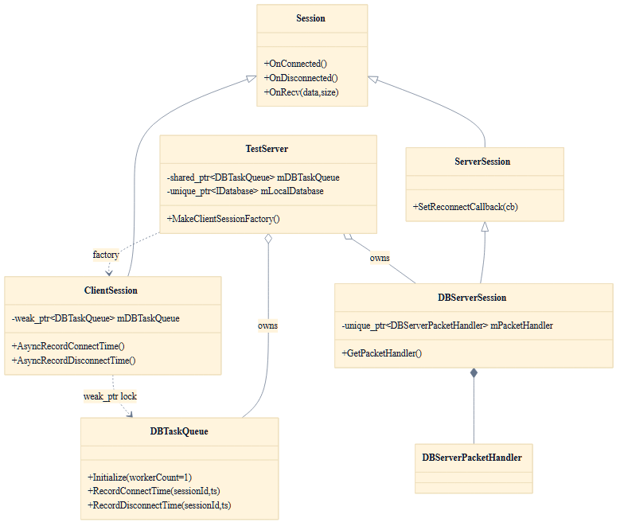
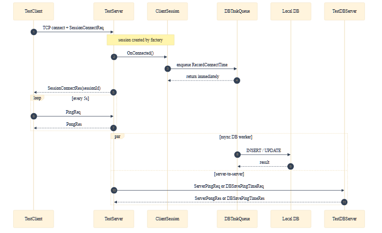

# NetworkModuleTest

**C++17 크로스플랫폼 네트워크 엔진 테스트베드**

Windows(IOCP/RIO) · Linux(epoll/io_uring) · macOS(kqueue) 백엔드를
단일 인터페이스(`INetworkEngine`)로 추상화합니다.
실제 클라이언트-서버 부하 환경에서 **세션 관리 · 비동기 DB · 재연결 흐름**을 검증합니다.

---

## 전체 아키텍처

<p align="center">
  
</p>

`TestClient → TestServer → TestDBServer(옵션)` 3-tier 구조.
`ServerEngine`이 플랫폼별 IO 백엔드를 선택하고,
`SessionManager / SessionPool`이 세션 생명주기를 관리합니다.

---

## 세션 계층

<p align="center">
  
</p>

---

## 패킷 · 비동기 DB 흐름

<p align="center">
  
</p>

---

## 주요 특징

| 구분 | 내용 |
|------|------|
| **IO 백엔드** | Windows: IOCP / RIO &nbsp;·&nbsp; Linux: epoll / io_uring &nbsp;·&nbsp; macOS: kqueue |
| **세션 관리** | `SessionPool` + `KeyedDispatcher` (세션 키 기반 직렬화, 락 없는 순서 보장) |
| **비동기 DB** | `DBTaskQueue` → SQLite / ODBC / OLE DB 멀티 백엔드 인터페이스 |
| **자동 재연결** | `TimerQueue` 기반 DB 서버 자동 재연결 정책 |
| **버퍼 풀** | RIO slab pool · io_uring fixed buffer 사전 등록 (Non-Paged Pool 절약) |
| **Send 백프레셔** | 큐 임계치 초과 시 `SendResult::QueueFull` 반환 |
| **Linux 통합 테스트** | Docker 3-tier (DBServer → Server → Client) 자동화 · 결과 git 자동 저장 |

---

## 플랫폼별 빠른 시작

### Windows — VS 2022

> **선결 조건:** Visual Studio 2022 + C++ 빌드 도구(MSVC v143) + Windows SDK 10.0
> → MSBuild PATH 등록 없이 자동 탐지합니다 (vswhere 사용).

```powershell
# 빌드
.\build_all.ps1

# 서버 시작 (DBServer:18002, Server:19010 — 충돌 시 자동 fallback)
.\run_allServer.ps1

# 클라이언트 실행
.\run_client.ps1

# 통합 테스트 (5초)
.\run_test_auto.ps1 -RunSeconds 5
```

### Linux — 네이티브

> **선결 조건 (Ubuntu 22.04):**

```bash
sudo apt-get install -y cmake build-essential pkg-config liburing-dev libsqlite3-dev
```

```bash
# io_uring + SQLite 포함 빌드
./scripts/build_unix.sh --enable-io-uring --enable-db

# 실행 (DBServer:9001, Server:9000)
./build/DBServer -p 9001 &
./build/TestServer -p 9000 --db-host 127.0.0.1 --db-port 9001 &
./build/TestClient --host 127.0.0.1 --port 9000 --pings 5
```

### Linux — Docker (Windows 호스트)

> **선결 조건:** [Docker Desktop](https://www.docker.com/products/docker-desktop) (WSL2 백엔드)

```powershell
# epoll + io_uring 통합 테스트 (이미지 자동 빌드)
.\test_linux\run_docker_test.ps1

# 결과를 git에 자동 커밋/푸시
.\test_linux\run_docker_test.ps1 -Push
```

### macOS

> **선결 조건:** `xcode-select --install` + `brew install cmake pkg-config`

```bash
# ServerEngine 컴파일 검증
./scripts/verify_macos.sh

# 전체 빌드 (TestServer, DBServer, TestClient)
./scripts/build_unix.sh --config Release
```

---

## 기본 포트

| 실행 파일 | Windows | Linux / macOS |
|-----------|:-------:|:-------------:|
| TestDBServer | `18002` | `9001` |
| TestServer   | `19010` | `9000` |

> 포트 충돌 시 자동으로 다음 빈 포트로 fallback합니다.
> 포트를 고정하려면 `-DisablePortFallback`을 사용하세요.

---

## 문서

### 핵심 문서

| 문서 | 내용 |
|------|------|
| [01 프로젝트 개요](Doc/01_ProjectOverview.md) | 프로젝트 범위 · 현재 상태 · 변경 이력 |
| [02 아키텍처](Doc/02_Architecture.md) | 런타임 구조 · 모듈 관계 · 플랫폼별 엔진 |
| [03 프로토콜](Doc/03_Protocol.md) | PacketDefine · ServerPacketDefine 바이너리 포맷 |
| [04 API](Doc/04_API.md) | CLI 옵션 · 주요 C++ API 레퍼런스 |
| [05 개발 가이드](Doc/05_DevelopmentGuide.md) | **플랫폼별 빌드 · 실행 · 테스트 상세** |
| [06 솔루션 가이드](Doc/06_SolutionGuide.md) | 솔루션/프로젝트 구성 · 빌드 순서 |
| [07 코드-문서 매핑](Doc/07_VisualMap.md) | 디렉터리 ↔ 문서 연결 지도 |

### 아키텍처 다이어그램 (Wiki)

| 문서 | 내용 |
|------|------|
| [01 전체 구조](Doc/WikiDraft/ServerStructure/01-Overall-Architecture.md) | 3-tier 전체 구성도 |
| [02 세션 계층](Doc/WikiDraft/ServerStructure/02-Session-Layer.md) | 세션 생명주기 · UML |
| [03 패킷·비동기 DB](Doc/WikiDraft/ServerStructure/03-Packet-and-AsyncDB-Flow.md) | 패킷 처리 · DB 비동기 흐름 |
| [04 Graceful Shutdown](Doc/WikiDraft/ServerStructure/04-Graceful-Shutdown.md) | 종료 시퀀스 |
| [05 재연결 전략](Doc/WikiDraft/ServerStructure/05-Reconnect-Strategy.md) | DB 자동 재연결 정책 |

### 보고서 · 성능

| 문서 | 내용 |
|------|------|
| [Wiki 패키지](Doc/Reports/WikiPackage/) | 게시용 최종 다이어그램 패키지 |
| [Executive Summary](Doc/Reports/ExecutiveSummary/) | 요약 보고서 (다이어그램 포함) |
| [팀 공유 보고서](Doc/Reports/TeamShare/) | 팀 공유용 상세 보고서 |
| [성능 테스트 로그](Doc/Performance/Logs/) | Windows · Linux 벤치마크 결과 |

### DB 모듈 테스트

| 문서 | 내용 |
|------|------|
| [DBModuleTest 가이드](ModuleTest/DBModuleTest/Doc/README.md) | DB 백엔드 테스트 전체 가이드 |
| [빠른 참조](ModuleTest/DBModuleTest/Doc/README_SHORT.md) | 한 페이지 요약 |

---

## 프로젝트 구조

```
NetworkModuleTest/
├── Server/
│   ├── ServerEngine/              # 핵심 엔진 (정적 라이브러리)
│   │   ├── Network/Core/          # INetworkEngine · Session · PacketDefine
│   │   ├── Network/Platforms/     # Windows(IOCP/RIO) · Linux(epoll/io_uring) · macOS(kqueue)
│   │   ├── Concurrency/           # KeyedDispatcher · AsyncScope · TimerQueue
│   │   └── Database/              # IDatabase → SQLite / ODBC / OLE DB
│   ├── TestServer/                # 클라이언트 수락 서버
│   └── DBServer/                  # 서버 간 패킷 처리 서버
│
├── Client/TestClient/             # 부하 · 연결 테스트 클라이언트
│
├── ModuleTest/
│   ├── DBModuleTest/              # DB 모듈 독립 테스트 (5 백엔드)
│   └── MultiPlatformNetwork/      # 플랫폼별 AsyncIO Provider 단독 테스트
│
├── test_linux/                    # Linux Docker 통합 테스트
│   ├── Dockerfile
│   ├── docker-compose.yml
│   └── scripts/
│
├── scripts/                       # 플랫폼별 빌드 스크립트
│   ├── build_windows.ps1          # Windows (MSBuild 자동 탐지)
│   ├── build_unix.sh              # Linux / macOS (CMake)
│   ├── verify_macos.sh            # macOS ServerEngine 검증
│   └── db_tests/                  # DB 백엔드별 Docker 테스트
│
└── Doc/                           # 설계 문서 및 개발 가이드
    ├── WikiDraft/ServerStructure/ # 아키텍처 다이어그램 (mmd 소스 + 이미지)
    ├── Reports/                   # 보고서 패키지
    └── Performance/               # 성능 분석 로그
```

---

## 기술 스택

| 구분 | 내용 |
|------|------|
| **언어** | C++17 |
| **Windows 빌드** | MSBuild / Visual Studio 2022 (MSVC v143) |
| **Linux · macOS 빌드** | CMake 3.15+ / GCC 12+ / Clang |
| **IO 백엔드** | WinSock2 RIO · IOCP · Linux epoll · io_uring · BSD kqueue |
| **DB** | SQLite3 · ODBC (MSSQL / PostgreSQL / MySQL) · OLE DB |
| **Linux 테스트** | Docker · docker-compose · Ubuntu 22.04 |
